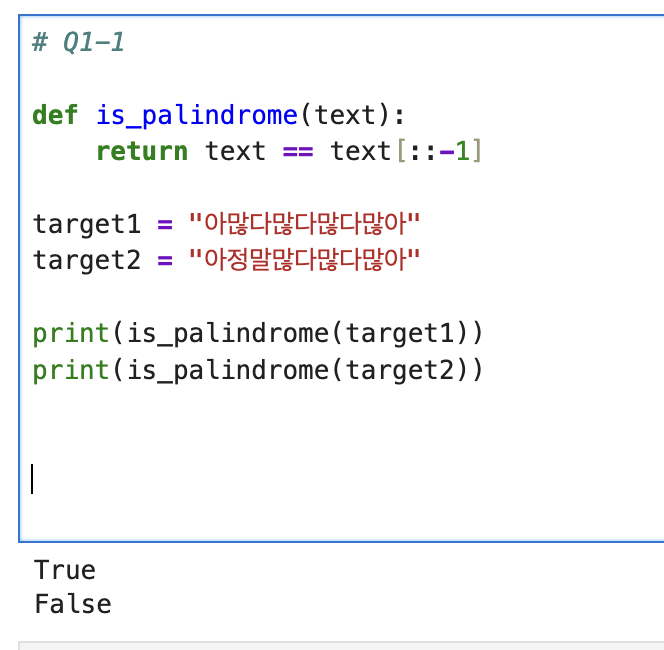
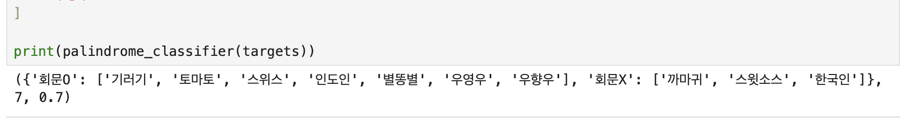
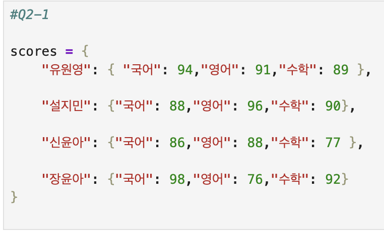
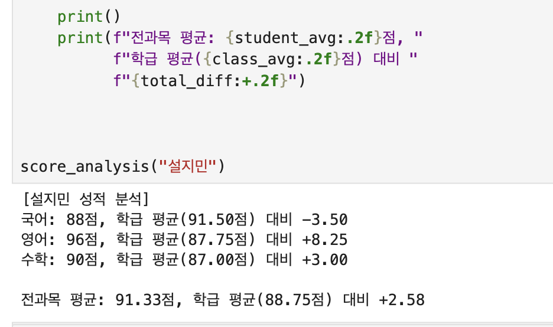
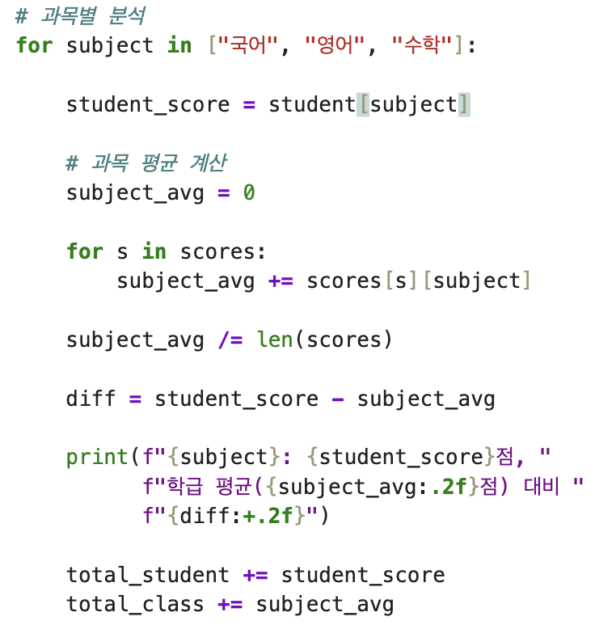
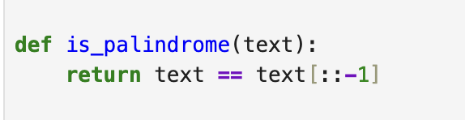

# AIFFEL Campus Online Code Peer Review Templete
- 코더 : 이근묵
- 리뷰어 : 이다겸


# PRT(Peer Review Template)
- [X]  **1. 주어진 문제를 해결하는 완성된 코드가 제출되었나요?**
    - 문제에서 요구하는 최종 결과물이 첨부되었는지 확인
        - 중요! 해당 조건을 만족하는 부분을 캡쳐해 근거로 첨부
주어진 문제에서 요구하는 결과물이 정상적으로 출력되었음.  
  
  
  
  
    
- [ ]  **2. 전체 코드에서 가장 핵심적이거나 가장 복잡하고 이해하기 어려운 부분에 작성된 
주석 또는 doc string을 보고 해당 코드가 잘 이해되었나요?**
    - 해당 코드 블럭을 왜 핵심적이라고 생각하는지 확인
    - 해당 코드 블럭에 doc string/annotation이 달려 있는지 확인
    - 해당 코드의 기능, 존재 이유, 작동 원리 등을 기술했는지 확인
    - 주석을 보고 코드 이해가 잘 되었는지 확인
        - 중요! 잘 작성되었다고 생각되는 부분을 캡쳐해 근거로 첨부
     
이중 딕셔너리 구조에서 Key를 이용해서 Value 들을 뽑아내는 과정은 해당 함수에서 핵심적인 부분이라고 생각한다.   
해당 코드에 기능에 대한 주석이 달려있지만 존재 이유, 작동 원리를 주석을 통해서 알기에는 어렵다.    
    
        
- [ ]  **3. 에러가 난 부분을 디버깅하여 문제를 해결한 기록을 남겼거나
새로운 시도 또는 추가 실험을 수행해봤나요?**
    - 문제 원인 및 해결 과정을 잘 기록하였는지 확인
    - 프로젝트 평가 기준에 더해 추가적으로 수행한 나만의 시도, 
    실험이 기록되어 있는지 확인
        - 중요! 잘 작성되었다고 생각되는 부분을 캡쳐해 근거로 첨부
     
에러가 난 부분에 대한 기록은 따로 남아있지 않다. 


        
- [ ]  **4. 회고를 잘 작성했나요?**
    - 주어진 문제를 해결하는 완성된 코드 내지 프로젝트 결과물에 대해
    배운점과 아쉬운점, 느낀점 등이 기록되어 있는지 확인
    - 전체 코드 실행 플로우를 그래프로 그려서 이해를 돕고 있는지 확인
        - 중요! 잘 작성되었다고 생각되는 부분을 캡쳐해 근거로 첨부
     
회고는 따로 작성되어 있지 않다. 


        
- [x]  **5. 코드가 간결하고 효율적인가요?**
    - 파이썬 스타일 가이드 (PEP8) 를 준수하였는지 확인
    - 코드 중복을 최소화하고 범용적으로 사용할 수 있도록 함수화/모듈화했는지 확인
        - 중요! 잘 작성되었다고 생각되는 부분을 캡쳐해 근거로 첨부

간결한 코드로 회문 분류 코드를 작성하였으며, 코드의 반복을 최소화 하기 위한 함수화도 잘 수행되었다.   
  

# 회고(참고 링크 및 코드 개선)
```
온보딩 기간 중 진행되었던 피어리뷰 퀘스트에 참석하지 못해서 이번이 첫 피어리뷰여서 코드 작성시 어떤 부분이 추가되어야 할지, 어떤 부분을 주의해야 할지에 대해서 리뷰를 하면서 배우는 시간이 된 것 같다. 
파이썬은 간결한 코드를 작성하는 것이 중요한 것을 머리로는 알지만 여전히 아직 익숙치 않은 부분이 있는데, 코더분의 코드는 깔끔하고 간결하게 작성되어 이 부분은 나 역시도 추구해야 할 방향이라 생각한다. 
다만 과목별 평균을 구하는 부분에서 중복 연산이 발생하는 부분이 있어 이 부분을 개선한다면 더 좋은 코드가 될 수 있을거라 생각한다. 
내가 작성한 코드도 마찬가지이지만, 에러가 난 부분을 기록하지 않았는데 이 역시도 모두 기록해서 다음번에 동일한 에러가 발생해도 바로 해결할 수 있는 힘을 길러야 할 것 같다.  
```
