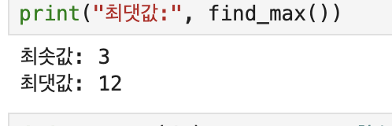
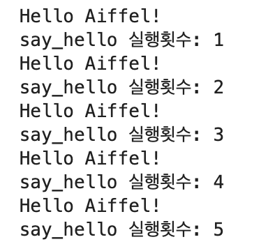
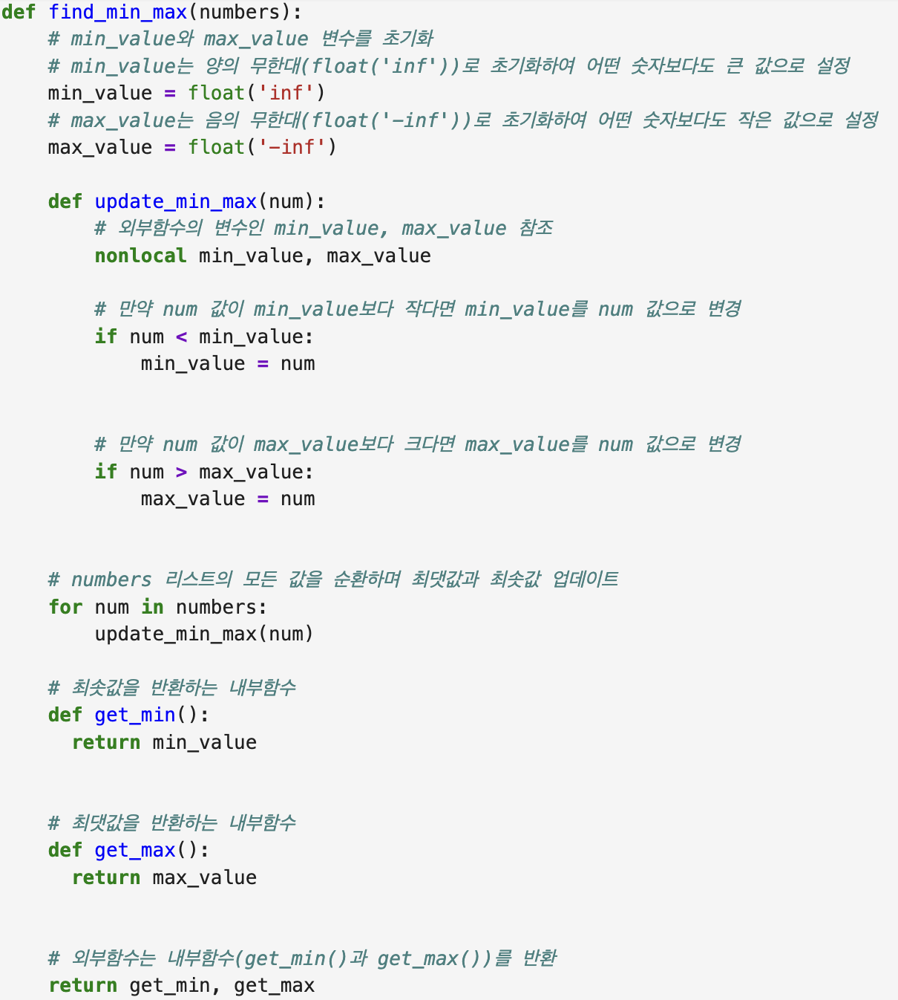
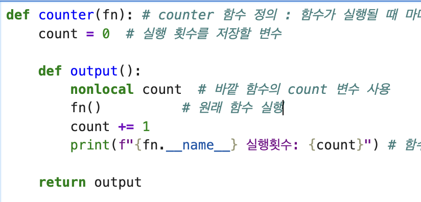

# AIFFEL Campus Online Code Peer Review Templete
- 코더 : 이근목
- 리뷰어 : 이다겸


# PRT(Peer Review Template)
- [x]  **1. 주어진 문제를 해결하는 완성된 코드가 제출되었나요?**

1번 문제  
     
2번 문제    



    
- [x]  **2. 전체 코드에서 가장 핵심적이거나 가장 복잡하고 이해하기 어려운 부분에 작성된 
주석 또는 doc string을 보고 해당 코드가 잘 이해되었나요?**   

주어진 리스트에서 요소를 뽑아내고, 거기서 최솟값과 최댓값을 찾아내기 위한 과정이 명확하게 구현되었고, 주석으로도 충분히 설명되어 있다.    

   
   
        
- [ ]  **3. 에러가 난 부분을 디버깅하여 문제를 해결한 기록을 남겼거나
새로운 시도 또는 추가 실험을 수행해봤나요?**   
   
에러가 난 부분에 대한 기록이나 추가 실험에 대한 기록은 따로 작성되어 있지 않다.  
        
- [ ]  **4. 회고를 잘 작성했나요?**

회고 부분은 따로 작성되어 있지 않다. 
        
- [x]  **5. 코드가 간결하고 효율적인가요?**
  
복합대입연산자를 활용해서 코드를 간결하게 만들었다.     



# 회고(참고 링크 및 코드 개선)
```
# 리뷰어의 회고를 작성합니다.
# 코드 리뷰 시 참고한 링크가 있다면 링크와 간략한 설명을 첨부합니다.
# 코드 리뷰를 통해 개선한 코드가 있다면 코드와 간략한 설명을 첨부합니다.
```
변수의 범위, 중첩함수 및 클로저, 데이코레이션 개념을 모두 사용해야 하는 퀘스트였지만 훌륭히 잘 수행되었다고 생각한다. 
이번 퀘스트부터 2인이 1조가 되어서 한 명이 알고리즘을 말로 설명하고, 다른 한 명은 그 말을 바탕으로 코드를 작성해야 하는 협동 퀘스트였는데 결과를 확인했을때 협업이 잘 이루어졌음을 알 수 있었다. 
