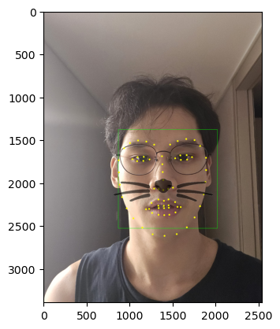
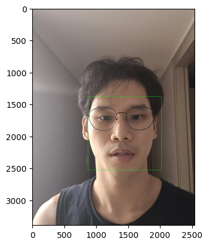
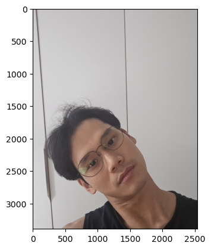

# AIFFEL Campus Online Code Peer Review Templete
- 코더 : 이근목
- 리뷰어 : 정슬기


# PRT(Peer Review Template)
- [x]  **1. 주어진 문제를 해결하는 완성된 코드가 제출되었나요?**
    - 얼굴 검출(dlib HOG detector) → 랜드마크 추출(68 landmarks) → 스티커(고양이 이미지) 위치/크기 계산 →
    - 반투명 합성까지 전체 파이프라인이 완성
    - 다만 응용 사진(각도/거리 변화)에서는 얼굴 인식이 실패했고(Cell 26~27, dlib_rects가 빈 리스트), 이 결과를 실패 사례로 정직하게 남긴 점이 좋습니다. 기본 미션은 해결, 응용 미션은 실패 원인 분석으로 마무리한 형태예요.
        
    
- [x]  **2. 전체 코드에서 가장 핵심적이거나 가장 복잡하고 이해하기 어려운 부분에 작성된 
주석 또는 doc string을 보고 해당 코드가 잘 이해되었나요?**
    - 가장 핵심 로직인 Cell 14 (스티커 합성 부분)에 단계별(1~5번) 주석이 매우 상세하게 달려 있어요. 특히 cv2.addWeighted로 반투명 합성을 구현하고, np.where로 흰 배경/스티커 영역을 구분하는 부분의 의도가 주석으로 명확히 설명되어 있습니다.
    -  list_landmarks 구조와 좌표 의미(코 index=30, 입 index=33 등)를 잘 풀어 설명함.
 
 
        
- [x]  **3. 에러가 난 부분을 디버깅하여 문제를 해결한 기록을 남겼거나
새로운 시도 또는 추가 실험을 수행해봤나요?**
    - 각도/거리/밝기 변화 응용 실험을 직접 수행했고, 실패(빈 dlib_rects)까지 정직하게 기록함.
    - 원인을 1위(각도)~3위(밝기)까지 영향도 순으로 분석한 점이 인상적입니다 — 단순 실패 기록이 아니라 원인을 가설 수준으로 분석한 시도.
    실험이 기록되어 있는지 확인

        
        
- [x]  **4. 회고를 잘 작성했나요?**
    - (각도/거리/밝기/속도/정확도)에 대해 매우 구체적이고 기술적으로 답변함. 특히 칼만 필터, 광학 흐름, MediaPipe 등 실제 상용 서비스 수준의 개선 방향까지 언급한 점이 좋은것 같습니다.
        - 중요! 잘 작성되었다고 생각되는 부분을 캡쳐해 근거로 첨부
        
- [ ]  **5. 코드가 간결하고 효율적인가요?**
    - 전반적으로 PEP8 네이밍(img_rgb_angle 등)은 준수하나, 매직 넘버(10, 0.4, 0.6 등)에 대한 상수화는 안 되어 있음


# 회고(참고 링크 및 코드 개선)
```
# 리뷰어의 회고를 작성합니다.

이번 프로젝트는 dlib 기반 얼굴 검출 → 랜드마크 추출 → 스티커 합성까지 
전체 파이프라인을 잘 구현했고, 특히 응용 미션에서 "실패"를 숨기지 않고 
원인 분석까지 기록한 점이 인상적이었습니다. 다만 코드를 따라가며 리뷰하는 
중 변수 혼용으로 인한 버그를 하나 발견해서 같이 공유합니다.

# 코드 리뷰 시 참고한 링크

- dlib 공식 얼굴 검출기 설명: http://dlib.net/face_detector.py.html
  → get_frontal_face_detector()가 정면 얼굴 데이터로만 학습되어 
    측면/큰 회전에서 실패하는 이유를 코드 리뷰 시 다시 확인함

- OpenCV addWeighted 공식 문서: https://docs.opencv.org/4.x/d2/de8/group__core__array.html
  → Cell 14에서 사용한 반투명 합성(weighted blending)의 파라미터 
    순서(src1, alpha, src2, beta, gamma)를 다시 확인함

# 코드 리뷰를 통해 발견한 버그

Cell 25번에서 변수 혼용 버그를 발견했습니다.

```python
# 기존 코드 (Cell 25) - 버그 있음
img_rgb_angle = cv2.cvtColor(img_bgr, cv2.COLOR_BGR2RGB)  
# ↑ img_bgr_angle이 아니라 img_bgr을 그대로 사용함
dlib_rects = detector_hog(img_rgb_angle, 1)
```

이 때문에 실제로는 **각도가 다른 새 사진(selfie.png)이 아니라 
원래 정면 사진(image.png)에 대해 얼굴 검출을 시도**하게 되어, 
"각도 때문에 인식 실패"라는 결론 자체의 근거가 흔들립니다. 
(원본 사진은 이미 검출에 성공했던 사진이라, 같은 사진으로 다시 
검출하면 실패할 이유가 없음 → 실제로는 다른 원인일 수도 있음)

# 개선 코드

```python (인공지능의 도움을 받아  작성된 내용으로 ,  참고만 해주세요 )
# 수정안: img_bgr_angle을 정확히 참조하도록 변경
img_rgb_angle = cv2.cvtColor(img_bgr_angle, cv2.COLOR_BGR2RGB)
dlib_rects = detector_hog(img_rgb_angle, 1)

for dlib_rect in dlib_rects:
    l, t, r, b = dlib_rect.left(), dlib_rect.top(), dlib_rect.right(), dlib_rect.bottom()
    # img_show가 아니라 img_show_angle에 박스를 그려야 결과가 실제로 반영됨
    cv2.rectangle(img_show_angle, (l, t), (r, b), (0, 255, 0), 2, lineType=cv2.LINE_AA)

plt.imshow(cv2.cvtColor(img_show_angle, cv2.COLOR_BGR2RGB))
plt.show()
```

위 수정 후 다시 실행해서 진짜 "각도 때문에" 실패하는지 재검증해보면 
회고에서 분석한 원인(정면 검출기의 한계)이 맞는지 더 정확하게 
확인할 수 있을 것 같습니다.

# 추가 제안: 중복 코드 함수화

Cell 6과 Cell 26의 얼굴 박스 그리기 로직이 동일하니, 아래처럼 
함수화하면 버그도 줄고 재사용성도 높아질 것 같습니다.

```python
def draw_face_boxes(img, dlib_rects, color=(0, 255, 0), thickness=2):
    """검출된 얼굴 영역에 사각형을 그려서 반환합니다."""
    for rect in dlib_rects:
        l, t, r, b = rect.left(), rect.top(), rect.right(), rect.bottom()
        cv2.rectangle(img, (l, t), (r, b), color, thickness, lineType=cv2.LINE_AA)
    return img
```
```
