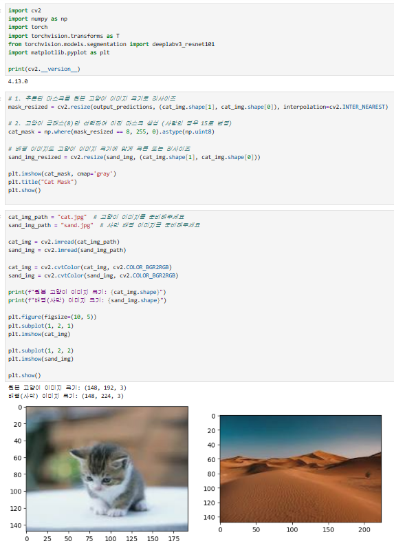
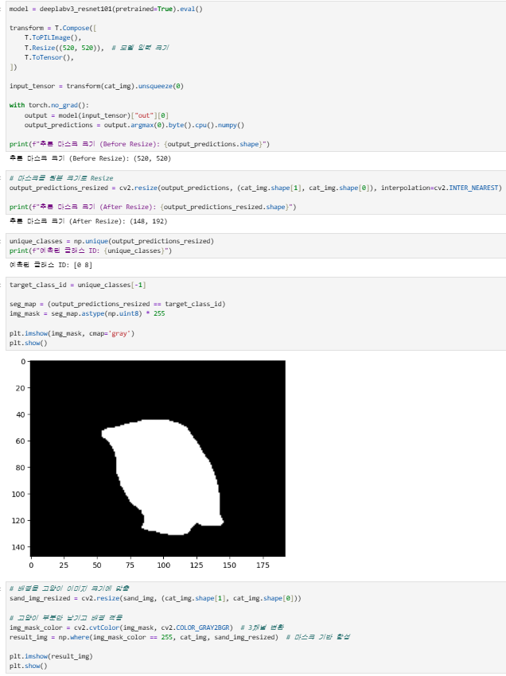
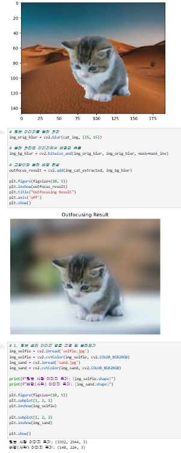
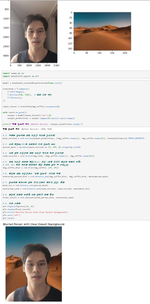
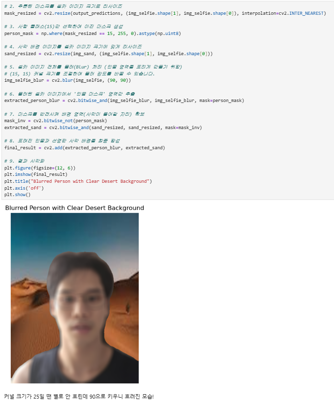
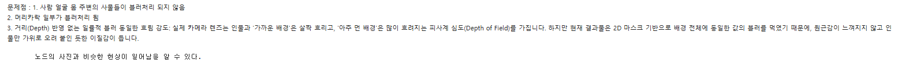
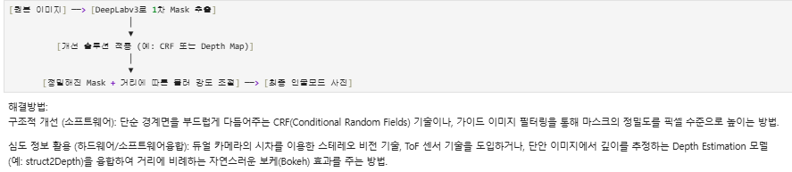

# AIFFEL Campus Online Code Peer Review Templete
- 코더 : 이근목
- 리뷰어 : 조현겸

# PRT(Peer Review Template)
- [x]  **1. 주어진 문제를 해결하는 완성된 코드가 제출되었나요?**

   

:이미지 불러오기와 사람 분리하기,배경 흐리게 만들기, 이미지 합성까지 모두 이상없이 잘 되는 것을 확인 했다.
    
- [x]  **2. 전체 코드에서 가장 핵심적이거나 가장 복잡하고 이해하기 어려운 부분에 작성된 
주석 또는 doc string을 보고 해당 코드가 잘 이해되었나요?**

:코드한줄마다 코드에대한 설명이 있어서 코드를 보기 편했다.
        
- [x]  **3. 에러가 난 부분을 디버깅하여 문제를 해결한 기록을 남겼거나
새로운 시도 또는 추가 실험을 수행해봤나요?**

:배경흐리기를 90까지 올려서 추가 실험을 하셨다. 이전보다 배경이 확실히 더 흐려져 이전에 어떤 배경이 있었는지 확인이 불가능 했다.
        
- [x]  **4. 회고를 잘 작성했나요?**

 

:cv의 한계점에 대해서 먼저 이야기를 한 후 개선 할 수 있는 방법을 정리하였다.
        
- [x]  **5. 코드가 간결하고 효율적인가요?**

:네

# 회고(참고 링크 및 코드 개선)

:리뷰를 하면서 문제점을 정리하는 부분을 보고 아주 멀리 있는 배경은 많이 흐려지는 피사계 심도를 가진다는 것이 흥미로웠다.
