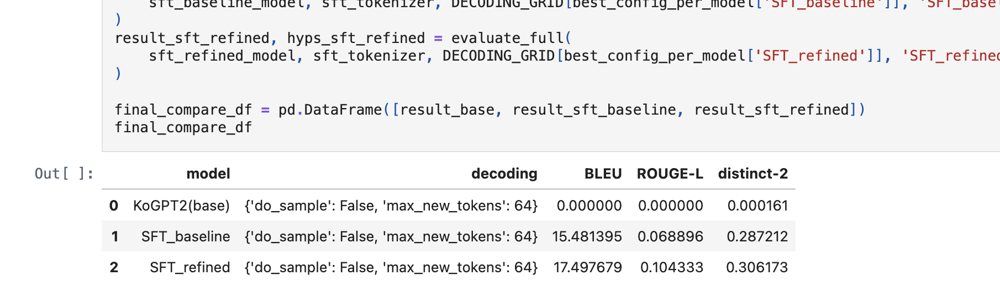
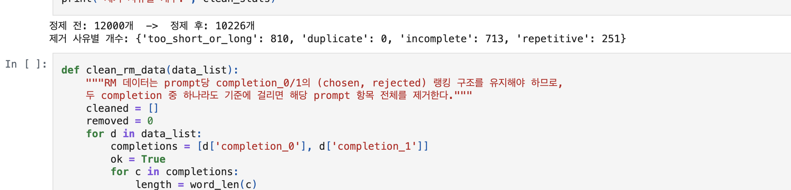
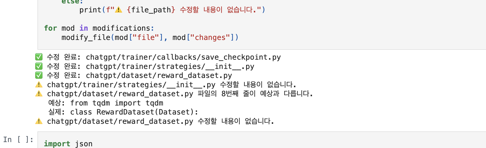
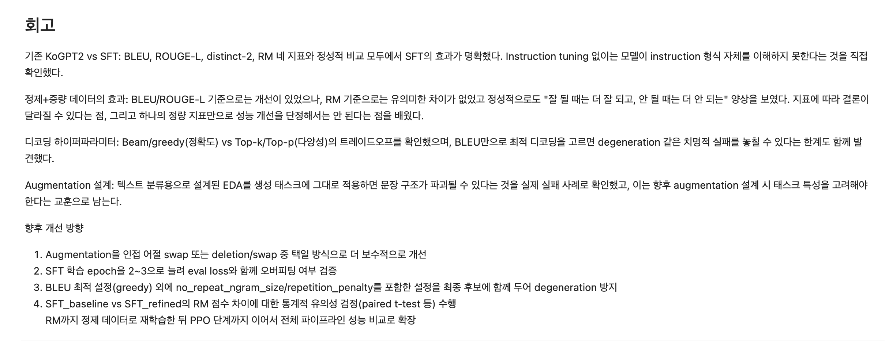
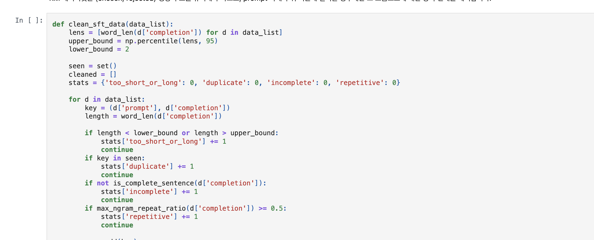

# AIFFEL Campus Online Code Peer Review Templete
- 코더 : 이근목
- 리뷰어 : 강경수


# PRT(Peer Review Template)
- [x]  **1. 주어진 문제를 해결하는 완성된 코드가 제출되었나요?**
    - > 루브릭이 요구하는 결과물이 모두 제출되었습니다.
    - 

- [x]  **2. 전체 코드에서 가장 핵심적이거나 가장 복잡하고 이해하기 어려운 부분에 작성된 
주석 또는 doc string을 보고 해당 코드가 잘 이해되었나요?**
    - 핵심 지점마다 "왜 이렇게 했는지"가 코드 또는 바로 위 마크다운에 설명되어 있어 따라가기 수월했습니다. 
    - 

- [x]  **3. 에러가 난 부분을 디버깅하여 문제를 해결한 기록을 남겼거나
새로운 시도 또는 추가 실험을 수행해봤나요?**
    - 두 축 모두 충실합니다. (디버깅) 섹션 0에서 구버전 KoChatGPT 코드가 최신 환경에서 깨지는 문제를 colossalai 의존 제거 패치(수정 파일·라인·전후 코드를 명시한 modifications 리스트)로 해결한 기록이 남아 있습니다. 
    - 

- [x]  **4. 회고를 잘 작성했나요?**
    — 배운 점·아쉬운 점·향후 방향이 구체적으로 정리되어 있습니다. 특히 "BLEU/ROUGE 기준으로는 개선됐지만 RM 기준으로는 차이가 없었다 → 하나의 정량 지표만으로 성능 개선을 단정하면 안 된다"는 결론과, "BLEU만으로 최적 디코딩을 고르면 degeneration 같은 실패를 놓칠 수 있다"는 지표의 한계 인식이 실험 결과에 뿌리를 둔 회고라 인상 깊었습니다.
    - 

- [x]  **5. 코드가 간결하고 효율적인가요?**
    — 함수 분리가 잘 되어 있어 재사용성이 높습니다. 정제(`clean_sft_data` — 제거 사유별 stats 카운팅 포함), 증강(`random_deletion`/`random_swap`/`eda_augment` 단계 분리), 평가(`compute_bleu`/`compute_rouge_l`/`compute_distinct_2`), 생성(`generate_response`)이 각각 단일 책임으로 나뉘어 있고, 같은 평가 파이프라인을 3개 모델 × 여러 디코딩 조합에 반복 적용할 수 있는 구조입니다. seed 고정으로 재현성도 챙겼고, 변수·함수 네이밍이 일관적(snake_case)이라 PEP8 기준에서도 무리가 없습니다.
    - 


# 회고(참고 링크 및 코드 개선)
```
정제 효과를 검증하기 위해 SFT를 baseline/refined 두 벌로 학습해 통제 비교한 설계가 이번 리뷰에서
가장 배울 점이었다. 나는 정제본 하나만 학습했는데, 이렇게 대조군을 두면 "정제가 실제로 효과가
있었는가"를 지표로 직접 보여줄 수 있다. distinct-2로 다양성 축을 추가한 것, 그리고 지표끼리 결론이
갈릴 때 그걸 감추지 않고 회고의 핵심 교훈으로 삼은 점도 좋았다.

```
