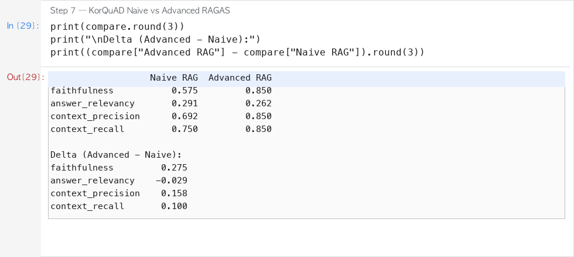
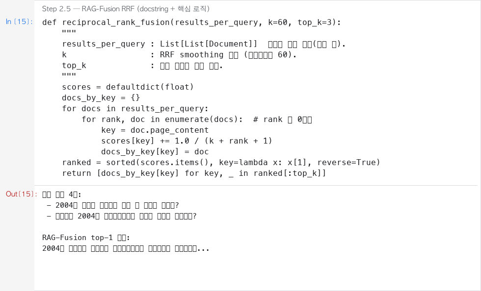
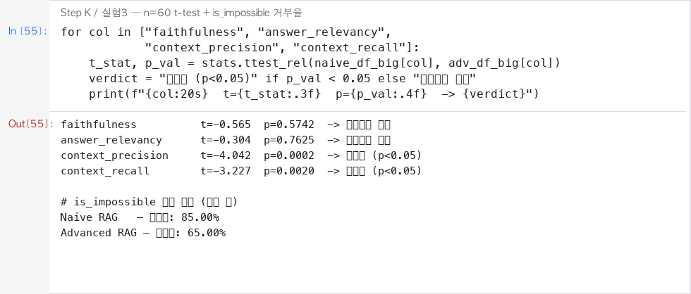
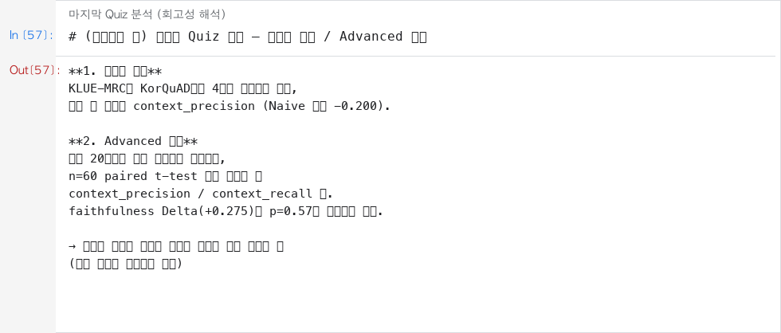
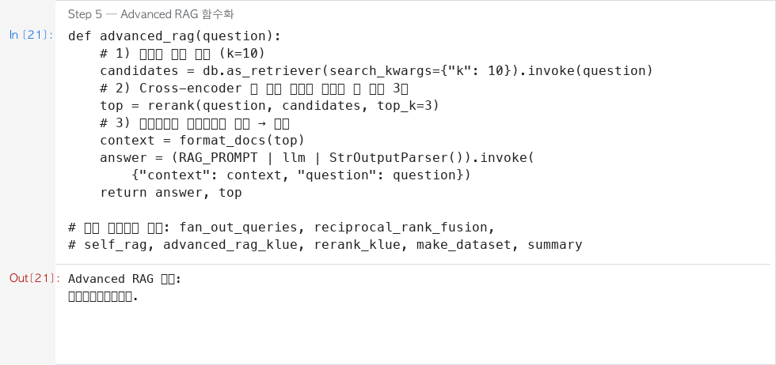

# AIFFEL Campus Online Code Peer Review Templete
- 코더 : 이근목
- 리뷰어 : 최승현


# PRT(Peer Review Template)
- [x]  **1. 주어진 문제를 해결하는 완성된 코드가 제출되었나요?**
    - KorQuAD Naive→Advanced RAG + RAGAS 비교표, KLUE-MRC 파이프라인까지 실행 결과가 남아 Quest 요구사항을 충족합니다.
    - 

- [x]  **2. 전체 코드에서 가장 핵심적이거나 가장 복잡하고 이해하기 어려운 부분에 작성된 
주석 또는 doc string을 보고 해당 코드가 잘 이해되었나요?**
    - RAG-Fusion의 `reciprocal_rank_fusion`에 docstring과 점수 누적 로직 주석이 있어 핵심 원리를 바로 이해할 수 있었습니다. Self-RAG 프롬프트도 판단 기준이 분명했습니다.
    - 
        
- [x]  **3. 에러가 난 부분을 디버깅하여 문제를 해결한 기록을 남겼거나
새로운 시도 또는 추가 실험을 수행해봤나요?**
    - 표본 60개 paired t-test로 소표본 착시를 검증하고, `is_impossible` 거부율 실험까지 수행한 점이 특히 좋았습니다.
    - 
        
- [x]  **4. 회고를 잘 작성했나요?**
    - 별도 `## 회고` 제목은 없지만, 마지막 Quiz 답변이 배운 점·아쉬운 점(소표본 착시, faithfulness ≠ 검색 개선 자동 연결)을 실험 수치로 잘 정리합니다. 다만 전체 실행 플로우 그래프는 보완하면 좋겠습니다.
    - 
        
- [x]  **5. 코드가 간결하고 효율적인가요?**
    - `advanced_rag` / `self_rag` / `reciprocal_rank_fusion` 등 단계가 함수로 잘 분리되어 재사용성이 높습니다.
    - 


# 회고(참고 링크 및 코드 개선)
```
리뷰 요약:
- Quest1/2(Advanced RAG + RAGAS + KLUE)를 충실히 충족한 제출입니다.
- n=60 t-test와 is_impossible 추가 실험이 돋보입니다.
- 개선 제안: (1) mermaid 등 전체 파이프라인 플로우 추가 (2) KorQuAD/KLUE 공통 헬퍼로 중복 축소
- 개선 제안: Self-RAG가 NOT_SUPPORTED여도 답을 내는 정책에 거부(refusal) 옵션을 넣으면 is_impossible 실험과도 잘 맞을 것 같습니다.
```
