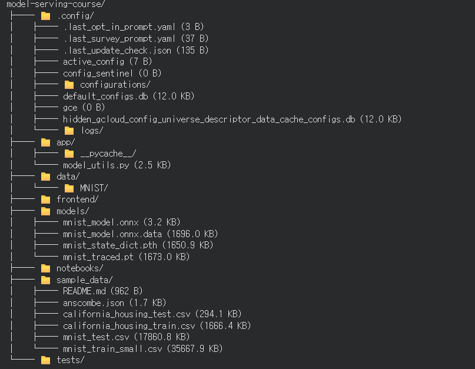

# 모델 배포 개론 — Day 1 체크포인트 답변

## 2. 각 섹션의 체크포인트 답변

### 섹션 1: 들어가며

**Q1. 모델 학습과 모델 배포의 핵심 차이를 한 문장으로 설명하세요.**

모델 학습은 데이터를 통해 최적의 파라미터를 찾아내는 "연구/실험" 과정이고, 모델 배포는 그렇게 만들어진 모델을 다른 사람(또는 시스템)이 안정적으로 재현 가능하게 요청-응답 형태로 사용할 수 있도록 서비스화하는 "엔지니어링" 과정입니다.

**Q2. "내 컴퓨터에서는 되는데" 문제의 근본 원인은 무엇입니까?**

로컬 개발 환경과 실행(서빙) 환경 사이에 존재하는 차이 — 즉 파이썬 버전, 설치된 패키지 버전, OS, 하드웨어(GPU/CPU) 등 실행 환경이 명확히 고정·기록되지 않아, 개발자의 컴퓨터에서만 우연히 맞아떨어진 조건에 의존하기 때문에 발생합니다. 환경이 코드와 함께 명시적으로 관리되지 않으면 동일한 코드도 다른 환경에서는 다르게 동작하거나 아예 실행되지 않을 수 있습니다.

---

### 섹션 2: 환경 세팅

**Q3. 가상환경을 사용하지 않으면 어떤 문제가 발생할 수 있습니까?**

- 여러 프로젝트가 전역(global) 파이썬 환경의 패키지를 공유하게 되어, 프로젝트마다 필요한 패키지 버전이 다를 경우 충돌이 발생합니다.
- 한 프로젝트를 위해 패키지를 업그레이드/다운그레이드하면 다른 프로젝트가 깨질 수 있습니다.
- 어떤 패키지가 실제로 이 프로젝트에 필요한지 파악하기 어려워지고, 결과적으로 "내 컴퓨터에서는 되는데" 문제로 이어집니다.

**Q4. pip freeze와 직접 작성한 requirements.txt의 용도 차이는?**

- `pip freeze`는 현재 환경에 **설치되어 있는 모든 패키지와 정확한 버전**을 그대로 덤프합니다. 의존성의 의존성까지 전부 포함되어 재현성은 높지만, 실제로 프로젝트가 무엇에 직접 의존하는지 파악하기 어렵고 불필요한 패키지까지 포함될 수 있습니다.
- 직접 작성한 requirements.txt는 **프로젝트가 실제로 필요로 하는 핵심 패키지만 명시적으로 기록**합니다. 가독성이 좋고 의도가 명확하지만, 세부 버전 고정은 개발자가 직접 관리해야 합니다.
- 실무에서는 개발 중에는 직접 작성하고, 배포 직전에는 `pip freeze`로 정확한 재현 스냅샷을 남기는 방식을 함께 사용하기도 합니다.

---

### 섹션 3: RESTful API

**Q5. 모델 추론 요청에 POST를 사용하는 이유는?**

모델 추론은 클라이언트가 이미지, 텍스트 등 **입력 데이터를 서버로 전송**하고 그 결과를 돌려받는 동작입니다. GET은 URL에 파라미터를 노출시키는 방식이라 크기 제한이 있고 민감한 데이터를 담기에 부적합한 반면, POST는 요청 본문(body)에 임의 크기·형식의 데이터를 담아 전송할 수 있습니다. 또한 추론 요청은 서버의 상태를 변경하거나 매번 다른 리소스를 생성하는 것에 가까운 동작(멱등하지 않은 처리)이므로 의미상으로도 POST가 적절합니다.

**Q6. 상태 코드 200, 400, 500은 각각 어떤 상황을 의미합니까?**

- **200 OK**: 요청이 정상적으로 처리되어 성공적인 응답을 반환한 상황.
- **400 Bad Request**: 클라이언트가 보낸 요청 자체에 문제가 있는 상황 (예: 잘못된 JSON 형식, 필수 필드 누락, 잘못된 입력 타입 등). 클라이언트 쪽 원인.
- **500 Internal Server Error**: 요청 자체는 올바르지만 서버 내부에서 처리 중 예상치 못한 오류가 발생한 상황 (예: 모델 로딩 실패, 코드 예외 등). 서버 쪽 원인.

---

### 섹션 4: 모델 직렬화

**Q7. state_dict 방식은 왜 모델 클래스 정의가 필요합니까?**

`state_dict`는 모델의 **가중치(파라미터) 값만** 저장하며, 모델의 구조(레이어 구성, forward 연산 흐름)는 저장하지 않습니다. 따라서 불러올 때는 동일한 아키텍처를 가진 클래스(`SimpleClassifier` 등)를 먼저 코드로 정의하고 인스턴스화한 뒤, 그 빈 구조에 저장된 가중치 값을 `load_state_dict()`로 채워 넣어야 합니다. 즉 "그릇(구조)은 코드로, 내용물(가중치)만 파일로" 저장하는 방식입니다.

**Q8. ONNX의 가장 큰 장점과, 사용해야 할 시점은?**

- **가장 큰 장점**: 프레임워크 독립성(interoperability). PyTorch로 학습한 모델을 ONNX로 변환하면, PyTorch가 설치되어 있지 않은 환경에서도 ONNX Runtime, TensorRT, 모바일/엣지 런타임 등 다양한 백엔드에서 추론할 수 있습니다. 모델 구조와 가중치가 함께 하나의 표준 포맷으로 저장되므로 클래스 정의도 필요 없습니다.
- **사용 시점**: 배포 환경이 학습 환경(PyTorch)과 다르거나(예: C++ 서버, 모바일, 엣지 디바이스), 추론 속도 최적화가 중요하거나, 여러 프레임워크 간 모델을 이식해야 할 때 사용하는 것이 적합합니다.

---

### 섹션 5: 실습

**Q9. 모델 저장 전에 model.eval()을 호출해야 하는 이유는?**

`Dropout`, `BatchNorm`처럼 학습(train)과 추론(eval) 시 동작이 다른 레이어들이 있기 때문입니다. `model.eval()`을 호출하지 않으면 Dropout이 계속 랜덤하게 뉴런을 비활성화하거나 BatchNorm이 배치 통계를 계속 갱신하는 등, 저장·추론 시점에 학습 모드 그대로 동작하여 결과가 매번 달라지거나 원래 학습된 성능과 다른 예측을 하게 됩니다. 특히 TorchScript(trace) 변환 시에는 이 상태가 그래프에 그대로 고정되므로 더욱 중요합니다.

**Q10. predict() 함수를 별도 모듈로 분리한 이유는 무엇입니까?**

- **재사용성**: 노트북뿐 아니라 FastAPI 엔드포인트 등 다른 곳에서도 동일한 전처리·추론 로직을 import해서 그대로 사용할 수 있습니다.
- **일관성 보장**: 추론 로직이 한 곳에만 있으므로, 노트북에서 검증한 결과와 실제 서빙 시 결과가 어긋날 위험이 줄어듭니다.
- **관심사 분리(Separation of Concerns)**: 모델 정의·전처리·추론 로직과 API 라우팅/요청 처리 로직을 분리함으로써 코드 유지보수와 테스트가 쉬워집니다.
- **배포 준비**: FastAPI 등 실제 서비스 코드가 이 모듈만 import하면 되므로, 노트북의 실험 코드와 배포용 코드를 명확히 분리할 수 있습니다.

---

## 1. 5-7 수행 내역 캡쳐

> 아래에 5.7 프로젝트 최종 구조 확인(`show_tree` 실행 결과) 캡쳐를 첨부하세요.

