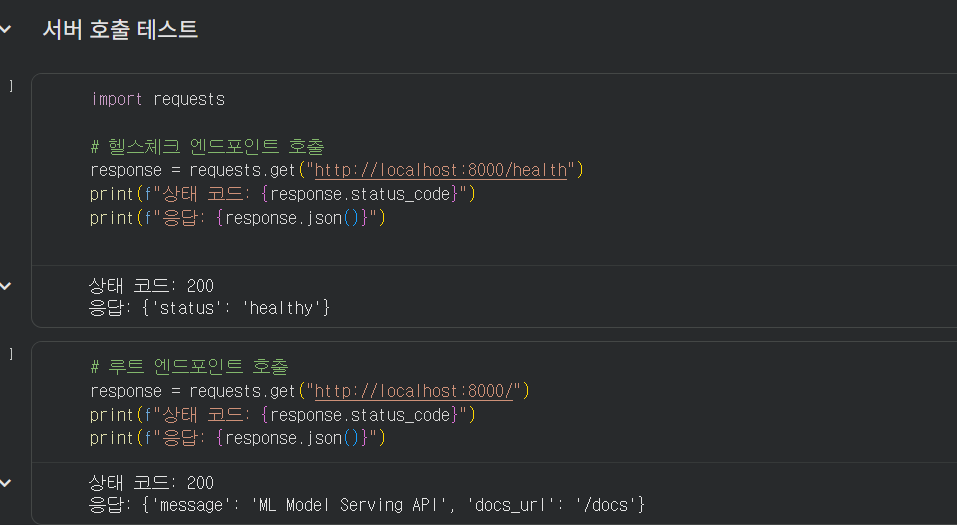
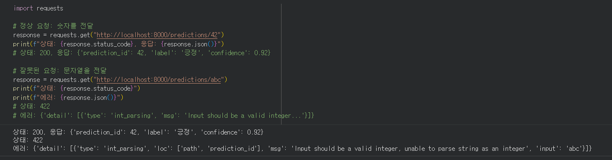
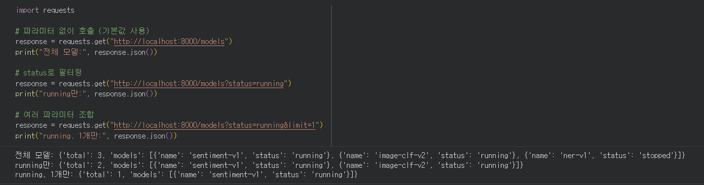
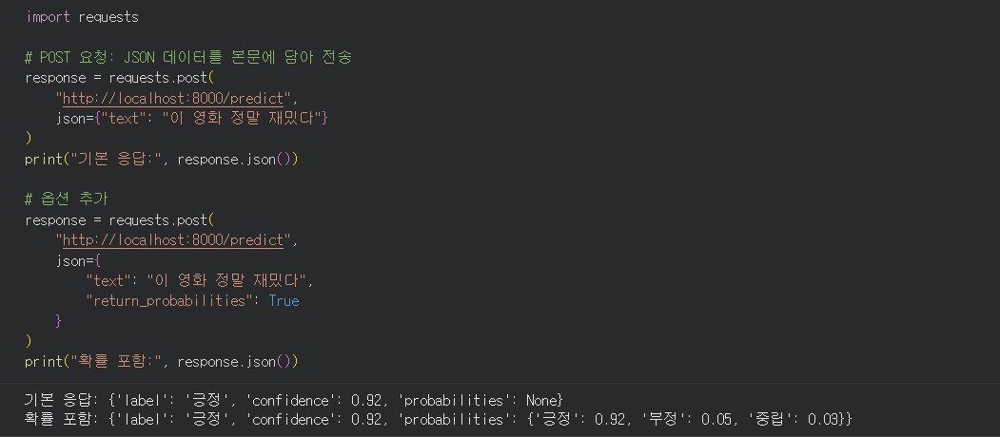
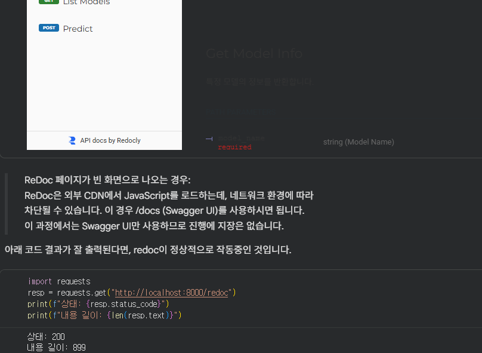
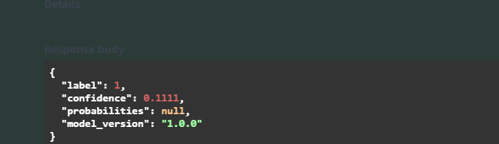

## 1. 섹션 1.5 수행 내역

### 최소한의 FastAPI 서버 실행

다음 내용이 확인되도록 실행 화면을 캡처하여 첨부합니다.

- FastAPI 서버 실행
- `GET /health` 요청 결과
- `GET /` 요청 결과
- 상태 코드와 JSON 응답

<!-- 아래 경로를 실제 캡처 파일 경로로 변경하세요. -->

---

## 2. 섹션 2, 3 셀 출력

### 섹션 2: Path, Query, Body 파라미터

다음 셀의 실행 결과를 기록합니다.

- Path 파라미터 요청
- 정수형 Path 파라미터의 정상 요청 및 검증 실패 요청
- Query 파라미터 요청
- Request Body를 사용한 POST 요청
- 필수 필드 누락 시 발생하는 422 응답

  
  

### 섹션 3: Swagger UI로 API 테스트

다음 셀의 실행 결과를 기록합니다.

- Swagger UI 실행 결과
- OpenAPI 스펙 확인 결과
- `PredictRequest` JSON Schema 출력
- ReDoc 요청 상태와 응답 길이

---

## 3. 섹션 5 수행 내역

### 모델 추론 엔드포인트 구현 및 테스트

다음 내용이 확인되도록 실행 화면을 캡처하여 첨부합니다.

- 모델 로드 성공
- FastAPI 서버 실행 및 헬스 체크
- MNIST 추론 요청과 응답
- 확률값을 포함한 추론 결과
- 여러 이미지에 대한 예측 결과
- 잘못된 입력에 대한 422 에러 처리
- Swagger UI에서의 요청 및 응답

<!-- 아래 경로를 실제 캡처 파일 경로로 변경하세요. -->

---

## 4. 각 섹션 체크포인트 답변

### 섹션 1

#### 1. FastAPI가 Flask보다 모델 배포에 적합한 이유 세 가지는 무엇입니까?

FastAPI는 타입 힌트를 기반으로 요청 데이터를 자동 검증하고, OpenAPI 기반 API 문서를 자동 생성하며, ASGI를 활용한 비동기 처리로 높은 성능을 제공하기 때문에 모델 배포에 적합합니다.

#### 2. Uvicorn의 역할은 무엇이며, 왜 FastAPI와 함께 사용합니까?

Uvicorn은 FastAPI 애플리케이션을 실제로 실행하고 HTTP 요청을 전달하는 ASGI 서버입니다. FastAPI 자체에는 운영 서버 기능이 없으므로 Uvicorn과 함께 사용합니다.

#### 3. `@app.get("/health")`에서 `get`과 `"/health"`는 각각 무엇을 의미합니까?

`get`은 HTTP GET 요청을 처리한다는 뜻이며, `"/health"`는 요청을 받을 URL 경로입니다.

#### 4. FastAPI에서 `dict`를 반환하면 어떤 일이 자동으로 일어납니까?

딕셔너리가 JSON 형식으로 직렬화되고, 적절한 응답 헤더와 함께 클라이언트에 전달됩니다.

### 섹션 2

#### 1. `/models/sentiment-v1`에서 `sentiment-v1`은 어떤 종류의 파라미터입니까?

URL 경로에 포함되는 Path 파라미터입니다.

#### 2. `/models?status=running&limit=5`에서 `status`와 `limit`은 어떤 종류의 파라미터입니까?

URL의 물음표 뒤에 전달되는 Query 파라미터입니다.

#### 3. 모델 추론 요청에 Request Body를 사용하는 이유는 무엇입니까?

텍스트, 이미지 배열, 옵션 등 구조가 복잡하거나 크기가 큰 데이터를 JSON 객체 형태로 안전하고 명확하게 전달할 수 있기 때문입니다.

#### 4. FastAPI에서 함수의 파라미터가 Path, Query, Body 중 어디서 오는지 어떻게 판별합니까?

라우트 경로에 선언된 변수는 Path, 경로에 없고 단순 타입인 함수 인자는 Query, Pydantic 모델 타입으로 선언된 인자는 일반적으로 Request Body로 판별합니다.

### 섹션 3

#### 1. FastAPI에서 Swagger UI에 접속하려면 어떤 URL로 이동합니까?

기본 설정에서는 `http://localhost:8000/docs`로 이동합니다.

#### 2. Swagger UI가 코드와 항상 동기화될 수 있는 이유는 무엇입니까?

FastAPI가 라우트, 타입 힌트, Pydantic 스키마와 설명을 바탕으로 OpenAPI 명세를 자동 생성하고 Swagger UI가 이를 읽어 표시하기 때문입니다.

#### 3. Pydantic 모델의 `Field(description=, examples=)`는 Swagger UI의 어디에 반영됩니까?

요청 스키마의 필드 설명과 예시 값에 반영되며, 요청 본문의 Schema 또는 Example 영역에서 확인할 수 있습니다.

#### 4. Swagger UI와 ReDoc의 핵심 차이는 무엇입니까?

Swagger UI는 브라우저에서 API를 직접 호출하며 테스트하기 편하고, ReDoc은 API 명세를 체계적으로 탐색하고 읽는 문서 중심 화면에 더 적합합니다.

### 섹션 4

#### 1. `text: str`과 `text: str = "기본값"`의 차이는 무엇입니까?

`text: str`은 반드시 전달해야 하는 필수 필드이고, `text: str = "기본값"`은 생략할 경우 지정된 기본값을 사용하는 선택 필드입니다.

#### 2. `Field(..., min_length=1, max_length=5000)`에서 `...`은 무엇을 의미합니까?

해당 필드에 기본값이 없으며 반드시 입력해야 한다는 의미입니다.

#### 3. 422 에러 응답에서 `loc` 필드는 어떤 정보를 담고 있습니까?

검증 오류가 발생한 위치를 나타냅니다. 예를 들어 요청 본문의 특정 필드에서 오류가 발생했다면 `body`와 필드명이 표시됩니다.

#### 4. `response_model`을 지정하면 어떤 이점이 있습니까?

응답 데이터의 구조를 검증하고, 불필요한 필드를 제거하며, 응답 스키마를 API 문서에 자동으로 표시할 수 있습니다.

### 섹션 5

#### 1. 모델을 서버 시작 시 한 번만 로드해야 하는 이유는 무엇입니까?

요청마다 모델을 다시 로드하면 디스크 접근과 초기화가 반복되어 응답이 느려지고 메모리와 연산 자원이 낭비되기 때문입니다.

#### 2. `pixel_values`가 784개가 아닌 요청이 들어오면 어떤 일이 발생합니까? 이를 처리하는 코드를 직접 작성했습니까?

Pydantic 스키마의 길이 검증에서 요청이 거부되고 HTTP 422 응답이 반환됩니다. Notebook에서는 `pixel_values`의 최소·최대 길이를 784로 제한하여 이 상황을 처리했습니다.

#### 3. `HTTPException(status_code=503)`은 어떤 상황에서 사용했습니까? 왜 500이 아니라 503입니까?

모델이 아직 로드되지 않아 추론 서비스를 일시적으로 제공할 수 없을 때 사용했습니다. 이는 서버 코드 자체의 예기치 않은 오류를 뜻하는 500보다, 서비스가 일시적으로 준비되지 않았음을 뜻하는 503에 더 적합합니다.

#### 4. Swagger UI에서 `PredictRequest`의 `description`과 `examples`가 어디에 표시됩니까?

`POST /predict` 엔드포인트의 Request body 영역에서 스키마 필드 설명과 예시 요청값으로 표시됩니다.

---

