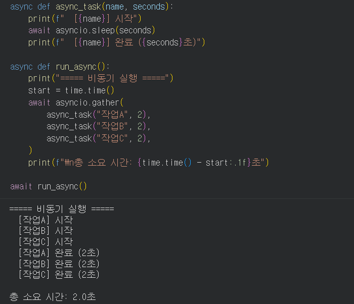
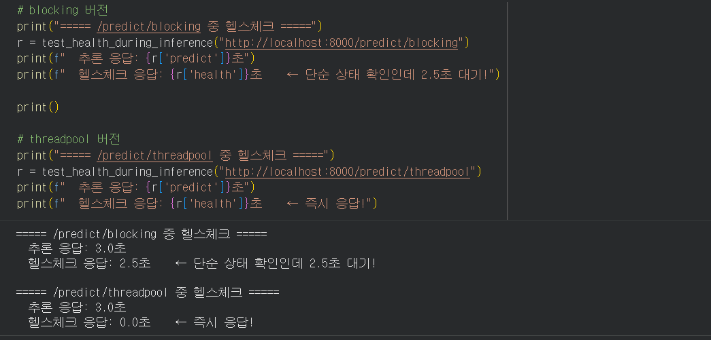
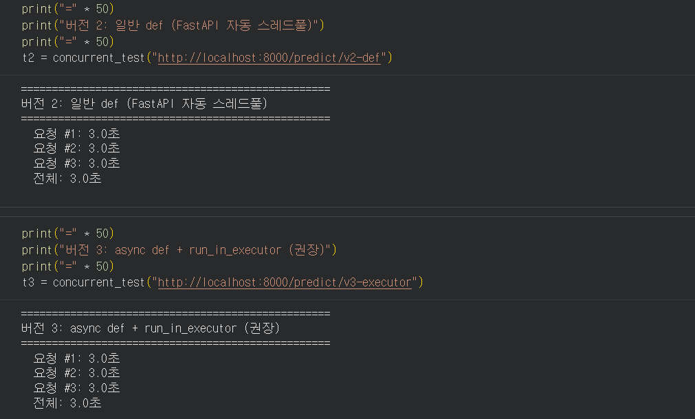
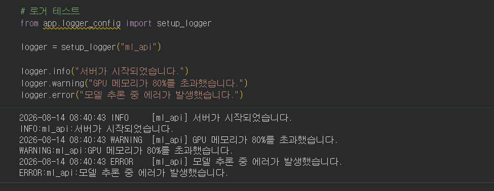
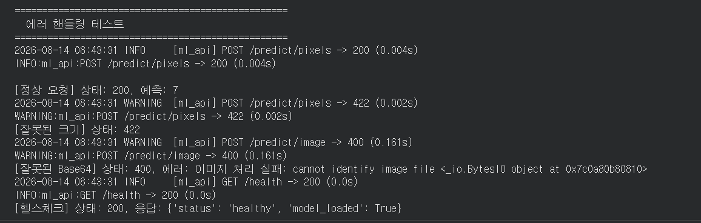

# 모델 배포 개론 Day 3 제출

## 비동기 처리와 에러 핸들링

- 제출일: `2026-08-14`
- 실습 환경: `[Google Colab ]`

> 아래의 이미지 경로에 맞춰 실행 화면을 저장한 뒤, 이 Markdown 파일과 `images` 폴더를 함께 GitHub에 업로드합니다. 파일명이 다르면 이미지 링크도 함께 수정합니다.

---

## 1. 동기와 비동기: 왜 API 서버에서 중요한가?

### 실행 결과

동기 처리에서는 앞선 요청의 작업이 끝날 때까지 다음 요청이 기다립니다. 반면 비동기 처리는 대기 가능한 작업 동안 이벤트 루프가 다른 요청을 처리할 수 있어 서버 자원을 더 효율적으로 활용합니다. 다만 모델 추론과 같은 동기 블로킹 작업을 `async def` 안에서 직접 실행하면 이벤트 루프가 멈출 수 있습니다.

> 이미지 설명: 동기/비동기 처리 흐름 또는 섹션 1 실행 결과 화면

---

## 2. async/await의 기본 원리

### 실행 결과

> 이미지 설명: `time.sleep()`과 `asyncio.sleep()`의 실행 시간 또는 출력 비교 화면

### 체크포인트 답변

#### 1. `time.sleep(3)`과 `await asyncio.sleep(3)`의 핵심 차이는 무엇입니까?

`time.sleep(3)`은 호출된 스레드를 3초 동안 멈추는 동기 블로킹 함수입니다. 이벤트 루프 스레드에서 실행하면 그동안 다른 코루틴이나 요청도 처리할 수 없습니다. 반면 `await asyncio.sleep(3)`은 3초 동안 현재 코루틴의 실행권을 이벤트 루프에 돌려주므로, 기다리는 동안 다른 요청이나 코루틴을 처리할 수 있습니다.

#### 2. 모델 추론처럼 CPU를 계속 사용하는 작업에서 `async/await`만으로 동시 처리가 안 되는 이유는 무엇입니까?

`async/await`은 작업을 자동으로 병렬화하지 않습니다. 네트워크나 타이머처럼 기다리는 지점에서 실행권을 양보할 때 효과가 있습니다. CPU 연산이나 동기식 모델 추론은 작업이 끝날 때까지 실행권을 계속 점유하므로 이벤트 루프가 다른 요청을 처리하지 못합니다. 이런 작업은 별도의 스레드풀이나 프로세스풀 등에 넘겨야 합니다.

---

## 3. 문제 시연: 동기 추론이 서버를 멈추는 순간

### 실행 결과

> 이미지 설명: 동시 요청의 응답 시간이 누적되는 테스트 결과

> 이미지 설명: 블로킹 추론 중 `/health` 요청까지 지연되는 화면

### 체크포인트 답변

#### 1. `async def` 안에서 `time.sleep(3)`을 호출하면 왜 다른 요청까지 지연됩니까?

`async def` 엔드포인트는 이벤트 루프에서 실행됩니다. 그 안에서 `time.sleep(3)`을 호출하면 이벤트 루프가 동작하는 스레드 자체가 3초 동안 멈춥니다. 이 시간에는 이벤트 루프가 다른 요청으로 전환할 수 없으므로 다른 요청도 함께 지연됩니다.

#### 2. 일반 `def`로 선언된 엔드포인트는 FastAPI가 내부적으로 어떻게 처리합니까?

FastAPI는 일반 `def`로 선언된 동기 엔드포인트를 이벤트 루프에서 직접 실행하지 않고 별도의 스레드풀에서 실행합니다. 따라서 해당 동기 함수가 실행되는 동안 메인 이벤트 루프는 다른 비동기 요청을 계속 처리할 수 있습니다.

#### 3. 블로킹 추론 중 헬스체크까지 막히면 실무에서 어떤 문제가 발생할 수 있습니까?

로드 밸런서나 컨테이너 오케스트레이터가 서버를 비정상 상태로 판단할 수 있습니다. 그 결과 정상 인스턴스가 트래픽 대상에서 제외되거나 불필요하게 재시작될 수 있고, 장애가 연쇄적으로 확대될 수 있습니다. 모니터링 지연, 타임아웃 증가, 사용자 요청 실패도 함께 발생할 수 있습니다.

---

## 4. 해결 패턴: run_in_executor로 블로킹 방지하기

### 실행 결과

> 이미지 설명: `run_in_executor` 적용 후 동시 요청 및 헬스체크 결과

### 체크포인트 답변

#### 1. `run_in_executor`가 이벤트 루프 블로킹을 방지하는 원리는 무엇입니까?

동기 블로킹 함수를 이벤트 루프 스레드에서 직접 실행하지 않고 별도의 실행기(executor)에 전달합니다. 실제 작업은 실행기의 작업 스레드에서 수행되고, 이벤트 루프는 그 결과를 비동기적으로 기다리면서 다른 요청을 계속 처리합니다.

#### 2. `run_in_executor`의 첫 번째 인자에 `None`을 넣으면 어떤 스레드풀이 사용됩니까?

현재 이벤트 루프에 설정된 기본 실행기, 즉 기본 `ThreadPoolExecutor`가 사용됩니다.

#### 3. 일반 `def`와 `async def + run_in_executor`의 핵심 차이는 무엇입니까?

일반 `def` 엔드포인트는 FastAPI가 함수 전체를 자동으로 스레드풀에서 실행합니다. `async def + run_in_executor` 방식은 엔드포인트 자체는 이벤트 루프에서 비동기로 동작하게 두고, 모델 추론처럼 블로킹되는 특정 부분만 명시적으로 실행기에 넘깁니다. 후자는 비동기 I/O와 동기 추론을 한 엔드포인트 안에서 세밀하게 조합하고 실행기 크기도 직접 제어하기 쉽습니다.

#### 4. GPU 추론 시 스레드풀 크기를 1~2로 제한하는 이유는 무엇입니까?

GPU는 메모리와 연산 자원이 제한되어 있습니다. 너무 많은 추론을 동시에 실행하면 GPU 메모리 부족(OOM), 컨텍스트 경합, 처리량 저하, 응답 시간의 불안정이 발생할 수 있습니다. 따라서 작은 스레드풀로 동시 접근을 제한해 메모리 사용량과 처리 안정성을 관리합니다.

---

## 5. 에러 핸들링과 로깅

### 실행 결과

> 이미지 설명: 정상 요청, 비정상 요청의 안전한 오류 응답, 서버 로그가 함께 보이는 화면

### 체크포인트 답변

#### 1. 글로벌 Exception Handler를 사용하면 어떤 반복을 줄일 수 있습니까?

각 엔드포인트마다 동일한 `try/except`, 로그 기록, 오류 응답 생성 코드를 반복하는 일을 줄일 수 있습니다. 예외 처리 정책을 한곳에서 일관되게 관리할 수 있다는 장점도 있습니다.

#### 2. 클라이언트에게 스택 트레이스를 노출하면 안 되는 이유는 무엇입니까?

스택 트레이스에는 내부 파일 경로, 코드 구조, 사용 라이브러리, 함수 이름 등 공격에 활용될 수 있는 정보가 포함될 수 있습니다. 또한 사용자에게 불필요하고 복잡한 정보입니다. 상세 오류는 서버 로그에 남기고, 클라이언트에는 안전하고 일관된 메시지만 반환해야 합니다.

#### 3. `logging` 모듈이 `print()`보다 나은 점은 무엇입니까?

`logging`은 시간, 로그 레벨, 모듈명 등의 정보를 일정한 형식으로 기록할 수 있습니다. 심각도별 필터링이 가능하고 콘솔뿐 아니라 파일이나 외부 로그 수집 서비스로도 보낼 수 있어 운영 환경에서 검색, 모니터링, 장애 분석에 유리합니다.

---

## 6. 최종 서버와 동시 요청 테스트

### 실행 결과

> 이미지 설명: 잘못된 요청에도 서버가 종료되지 않고 상태 코드와 메시지를 반환하는 화면

### Day 3 최종 체크포인트

#### Q1. 동기 서버에서 3초 걸리는 추론을 3명이 동시에 요청하면 총 몇 초 걸립니까?

요청이 순차적으로 처리된다는 가정에서 전체 완료까지 약 9초가 걸립니다. 첫 번째 사용자는 약 3초, 두 번째는 약 6초, 세 번째는 약 9초 후 응답을 받습니다.

#### Q2. `time.sleep(3)`과 `await asyncio.sleep(3)`의 핵심 차이는 무엇입니까?

`time.sleep(3)`은 실행 중인 스레드를 멈춰 이벤트 루프까지 블로킹할 수 있습니다. `await asyncio.sleep(3)`은 기다리는 동안 이벤트 루프에 실행권을 돌려주므로 다른 요청을 처리할 수 있습니다.

#### Q3. `async def` 안에서 동기 블로킹 코드를 실행하면 왜 헬스체크까지 영향받습니까?

동기 블로킹 코드가 단일 이벤트 루프 스레드를 점유하기 때문입니다. 이벤트 루프가 멈춰 있는 동안 같은 서버로 들어오는 헬스체크 요청도 라우팅과 응답 처리를 진행하지 못합니다.

#### Q4. `run_in_executor`가 이벤트 루프 블로킹을 방지하는 원리는 무엇입니까?

블로킹 작업을 별도의 스레드 또는 실행기로 넘기고, 이벤트 루프는 그 결과를 비동기적으로 기다립니다. 따라서 작업 중에도 이벤트 루프가 다른 요청을 처리할 수 있습니다.

#### Q5. 글로벌 Exception Handler를 사용하는 이유는 무엇입니까?

여러 엔드포인트의 예외 처리를 중앙화해 중복 코드를 줄이고, 모든 오류에 일관된 로깅과 안전한 응답 정책을 적용하기 위해 사용합니다.

#### Q6. 클라이언트에게 스택 트레이스를 노출하면 안 되는 이유는 무엇입니까?

내부 경로와 코드 구조, 라이브러리 정보 등 보안상 민감한 정보가 노출될 수 있기 때문입니다. 상세 내용은 서버 로그에만 기록하고 클라이언트에는 일반화된 오류 메시지를 제공해야 합니다.

---

## 최종 정리

이번 실습을 통해 동기 블로킹 작업이 이벤트 루프와 동시 요청 처리에 미치는 영향을 확인했습니다. `run_in_executor`를 사용하여 모델 추론을 별도 스레드에서 실행하고, 글로벌 예외 처리와 구조화된 로깅을 적용하여 API의 응답성과 안정성을 개선했습니다.

