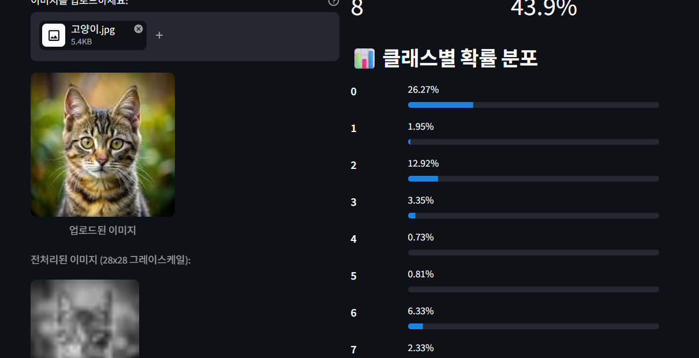

# Day 4 — Streamlit & System Architecture 제출

## 1. 섹션 5 수행내역 캡처

아래 구역에 섹션 5 실습 수행 화면을 캡처하여 추가합니다.

### 수행내역 캡처 1 — 백엔드 및 프론트엔드 실행

<!-- 아래 줄의 이미지 경로를 실제 캡처 파일 경로로 변경하세요. -->

### 수행내역 캡처 2 — MNIST 추론 결과

<!-- 아래 줄의 이미지 경로를 실제 캡처 파일 경로로 변경하세요. -->

### 수행내역 캡처 3 — 파일 업로드 테스트

<!-- 아래 줄의 이미지 경로를 실제 캡처 파일 경로로 변경하세요. 필요하지 않으면 이 항목을 삭제해도 됩니다. -->

---

## 2. 각 섹션 체크포인트 답변

### 섹션 1: Streamlit 소개

#### Q1. Streamlit의 스크립트 재실행 모델이란?

사용자가 버튼을 누르거나 입력값을 변경할 때마다 파이썬 스크립트 전체가 위에서 아래로 다시 실행되는 방식입니다. 위젯의 현재 값은 유지되지만, 일반 변수는 다시 만들어지므로 유지해야 하는 데이터는 캐시나 세션 상태를 사용해 관리해야 합니다.

### 섹션 2: 핵심 컨셉

#### Q2. `@st.cache_resource`를 사용하는 이유는?

Streamlit이 재실행될 때마다 API 클라이언트, 데이터베이스 연결, 모델과 같은 무거운 자원을 새로 생성하지 않고 한 번 생성한 객체를 재사용하기 위해 사용합니다. 이를 통해 불필요한 초기화 작업을 줄이고 앱의 실행 속도를 높일 수 있습니다.

### 섹션 3: System Architecture

#### Q3. 프론트엔드와 백엔드를 분리하는 핵심 이유 두 가지는?

1. **독립적인 개발과 배포:** UI와 모델 추론 로직을 각각 수정하고 배포할 수 있습니다. 예를 들어 모델만 변경하면 백엔드만 재배포하면 됩니다.
2. **확장성과 재사용성:** 하나의 백엔드 API를 Streamlit뿐 아니라 웹, 모바일 등 여러 클라이언트가 함께 사용할 수 있으며, 필요에 따라 프론트엔드와 백엔드를 각각 독립적으로 확장할 수 있습니다.

#### Q4. Streamlit 앱에 PyTorch가 필요 없는 이유는?

PyTorch를 이용한 모델 로드와 추론은 FastAPI 백엔드가 담당하기 때문입니다. Streamlit은 이미지를 HTTP 요청으로 백엔드에 보내고 JSON 응답을 받아 결과를 화면에 표시하므로 모델이나 PyTorch를 직접 다룰 필요가 없습니다.

### 섹션 4: API 호출

#### Q5. API 호출 실패 시 사용자에게 스택 트레이스가 아닌 메시지를 보여줘야 하는 이유는?

스택 트레이스는 일반 사용자가 이해하기 어렵고 내부 파일 경로, 코드 구조 등 민감한 구현 정보를 노출할 수 있습니다. 따라서 사용자가 문제 상황과 대응 방법을 쉽게 이해할 수 있도록 간결하고 친절한 오류 메시지를 보여주는 것이 사용자 경험과 보안 측면에서 적절합니다.

### 섹션 5: 실습

#### Q6. `st.session_state`에 결과를 저장하는 이유는?

Streamlit은 위젯을 조작할 때마다 스크립트 전체를 다시 실행합니다. 추론 결과를 `st.session_state`에 저장하면 재실행 후에도 이전 결과가 사라지지 않아 화면에 계속 표시할 수 있습니다.

#### Q7. 이미지를 API로 전달할 때 Base64 인코딩이 필요한 이유는?

이미지는 바이너리 데이터이므로 JSON 문자열에 그대로 담을 수 없습니다. 이미지 바이트를 Base64 문자열로 변환하면 JSON에 안전하게 포함하여 HTTP 요청으로 전송할 수 있고, 백엔드는 이를 다시 디코딩해 원래 이미지 바이트로 복원할 수 있습니다.
