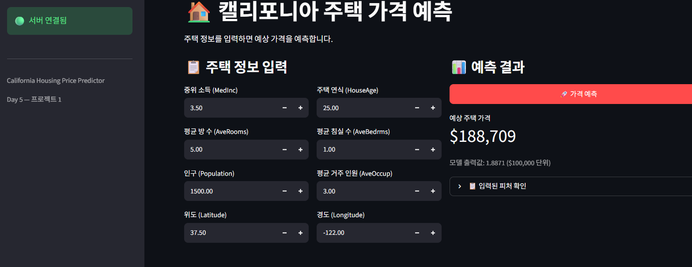
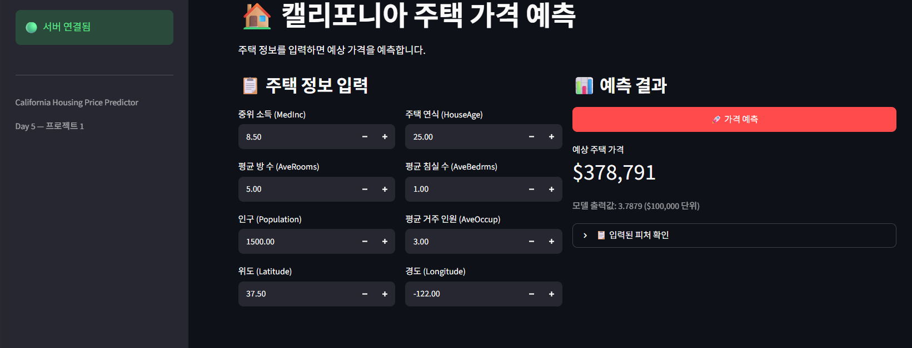
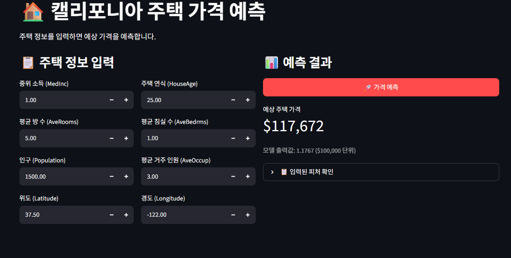
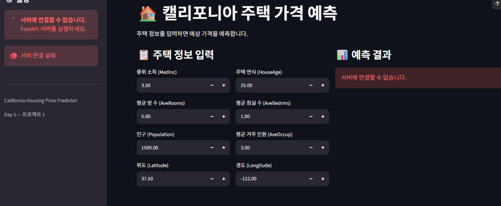

# Day 5 — 정형 데이터 예측 서비스 제출

## 1. 프로젝트 수행 내용

캘리포니아 주택 가격 데이터를 이용해 정형 데이터 회귀 모델을 학습하고, FastAPI 백엔드와 Streamlit 프론트엔드를 연결한 주택 가격 예측 서비스를 구성했습니다.

- 입력: 중위 소득, 주택 연식, 평균 방 수, 평균 침실 수, 인구, 평균 거주 인원, 위도, 경도
- 출력: 예측된 중위 주택 가격
- 모델 유형: PyTorch 회귀 모델
- 서비스 구조: `Streamlit → FastAPI → PyTorch 모델`

## 2. UI 실행 결과

노트북에서 Streamlit 프론트엔드를 포트 8501로 실행하고, Colab 프록시를 이용해 대시보드를 iframe으로 표시했습니다.

```text
✅ 프론트엔드 실행됨 (포트 8501) — 아래 Step 3에서 화면을 띄웁니다
✅ 대시보드를 아래에 띄웁니다 (Colab 프록시 → 포트 8501)
```

### 2.1 대시보드 기본 화면

중위 소득, 주택 연식, 평균 방 수, 평균 침실 수, 인구, 평균 거주 인원, 위도, 경도를 숫자로 입력할 수 있는 화면입니다. 사이드바에서 FastAPI 서버의 연결 상태도 확인할 수 있습니다.

> 아래 주석의 앞뒤 `<!--`, `-->`를 지우고, 실제 캡처 파일명과 일치하는지 확인하면 이미지가 표시됩니다.

 

### 2.2 가격 예측 실행 결과

입력값을 설정하고 **가격 예측** 버튼을 누르면 API가 반환한 예상 주택 가격과 모델 출력값이 결과 영역에 표시됩니다. 제출용 캡처에는 서버 연결 상태, 입력값, 예측 결과가 함께 보이도록 합니다.




## 3. 섹션별 체크포인트 답변

### 섹션 1 — 프로젝트 개요

#### 1. 이 프로젝트의 입력과 출력은 각각 무엇입니까?

입력은 캘리포니아 주택 데이터의 8개 수치형 피처인 `MedInc`, `HouseAge`, `AveRooms`, `AveBedrms`, `Population`, `AveOccup`, `Latitude`, `Longitude`입니다. 출력은 예측된 중위 주택 가격이며, 모델의 기본 출력 단위는 10만 달러입니다.

#### 2. MNIST 프로젝트와 비교했을 때, 데이터 형태가 어떻게 다릅니까?

MNIST는 28×28 픽셀의 그레이스케일 이미지가 입력인 분류 문제입니다. 이번 프로젝트는 서로 의미와 범위가 다른 8개의 수치형 피처로 이루어진 정형 데이터를 입력으로 사용하며, 연속적인 주택 가격을 예측하는 회귀 문제입니다.

#### 3. 오늘 새로 만들 파일 3개의 이름과 역할은 무엇입니까?

- `app/housing_model.py`: 주택 가격 모델 구조, 체크포인트 로드 및 추론 기능을 담당합니다.
- `app/housing_schemas.py`: 요청과 응답에 사용할 Pydantic 스키마 및 입력값 검증 규칙을 정의합니다.
- `app/housing_api.py`: 모델을 FastAPI와 연결하고 상태 확인 및 가격 예측 엔드포인트를 제공합니다.

프론트엔드 화면은 별도의 `frontend/app_housing.py`에 작성했습니다.

### 섹션 2 — 모델 학습과 저장

#### 1. 정규화에서 학습 데이터의 통계를 테스트 데이터에도 사용하는 이유는 무엇입니까?

테스트 데이터는 학습 과정에서 보지 않은 데이터로 남겨야 합니다. 테스트 데이터 자체의 평균과 표준편차를 사용하면 테스트 정보가 전처리에 반영되는 데이터 누수가 발생하고 평가 결과가 실제보다 좋아질 수 있습니다. 따라서 학습 데이터에서 계산한 평균과 표준편차를 테스트 데이터와 운영 입력에도 동일하게 적용해야 합니다.

#### 2. 모델 가중치 외에 함께 저장해야 하는 것은 무엇이고, 왜 필요합니까?

학습에 사용한 피처별 평균과 표준편차, 피처 이름 및 순서를 함께 저장해야 합니다. 추론 시에도 학습 때와 같은 방식으로 입력을 배열하고 정규화해야 모델이 올바른 값의 분포를 입력받을 수 있기 때문입니다.

#### 3. `HousingPredictor.predict()`에서 피처를 `self.feature_names` 순서로 배열하는 이유는 무엇입니까?

모델은 학습할 때 사용한 열 순서에 따라 각 입력값의 의미를 해석합니다. 순서가 바뀌면 예를 들어 소득값을 위도값처럼 처리할 수 있으므로, 요청 딕셔너리의 순서에 의존하지 않고 저장된 `feature_names` 순서로 배열해야 정확한 예측이 가능합니다.

### 섹션 3 — FastAPI 백엔드

#### 1. `HousingRequest`에서 `Latitude`에 `ge=32`, `le=42` 제한을 넣은 이유는 무엇입니까?

캘리포니아의 실제 위도 범위에 맞지 않는 값을 요청 단계에서 차단하기 위해서입니다. 입력 오류를 모델 추론 전에 발견할 수 있고, 모델이 학습 범위를 크게 벗어난 값으로 신뢰하기 어려운 예측을 만드는 것도 줄일 수 있습니다.

#### 2. `request.model_dump()`는 어떤 역할을 합니까?

검증이 완료된 Pydantic 모델 객체를 일반 파이썬 딕셔너리로 변환합니다. 이렇게 만든 딕셔너리를 예측 함수에 전달하여 각 피처 이름과 값을 사용할 수 있습니다.

#### 3. `run_in_executor`를 사용하지 않으면 어떤 문제가 발생할 수 있습니까?

모델 추론처럼 CPU를 사용하는 동기 함수를 비동기 엔드포인트에서 직접 실행하면 이벤트 루프가 그 작업이 끝날 때까지 막힐 수 있습니다. 그러면 다른 요청의 처리와 응답이 지연되고 동시 요청 처리 성능이 저하됩니다. `run_in_executor`는 추론 작업을 별도 실행 스레드에 맡겨 이벤트 루프가 다른 요청을 계속 처리할 수 있게 합니다.

### 섹션 4 — Streamlit 프론트엔드

#### 1. MNIST 대시보드와 비교했을 때 입력 방식이 어떻게 다릅니까?

MNIST 대시보드는 사용자가 이미지 파일을 업로드하거나 그림을 입력하는 방식입니다. 이번 대시보드는 8개의 주택 특성을 각각 `st.number_input()`에 숫자로 입력하고 이를 JSON 형태로 API에 전송합니다.

#### 2. `st.number_input()`에서 `min_value`, `max_value`를 설정하는 이유는 무엇입니까?

사용자가 현실적이거나 모델이 처리하도록 정한 범위 안의 값만 입력하게 하기 위해서입니다. 프론트엔드에서 잘못된 값을 미리 방지해 사용성을 높이고, 백엔드 검증 오류와 학습 범위를 벗어난 예측을 줄일 수 있습니다. 다만 프론트엔드 제한은 우회할 수 있으므로 백엔드의 Pydantic 검증도 함께 필요합니다.

#### 3. `request_data`의 키 이름이 `HousingRequest` 필드 이름과 정확히 일치해야 하는 이유는 무엇입니까?

FastAPI는 JSON의 키를 Pydantic 스키마의 필드 이름과 대응시켜 요청을 검증하고 객체를 생성합니다. 이름이 다르면 필수 필드가 누락된 것으로 판단되어 `422 Unprocessable Entity` 오류가 발생하거나, 모델에 필요한 값이 올바르게 전달되지 않습니다.

## 4. Day 5 최종 체크포인트

### Q1. 전처리 파라미터인 평균과 표준편차를 모델과 함께 저장해야 하는 이유는 무엇입니까?

운영 환경의 입력을 학습 때와 완전히 같은 기준으로 정규화하기 위해서입니다. 다른 평균과 표준편차를 사용하면 입력 분포가 달라져 모델의 예측 성능과 일관성이 떨어집니다.

### Q2. `HousingRequest`의 `Latitude`에 `ge=32`, `le=42`를 넣은 이유는 무엇입니까?

캘리포니아의 유효한 위도 범위를 벗어난 입력을 API 단계에서 차단하여 입력 오류와 비현실적인 예측을 줄이기 위해서입니다.

### Q3. Streamlit 입력값 이름이 Pydantic 스키마의 필드 이름과 일치해야 하는 이유는 무엇입니까?

요청 JSON의 각 값을 Pydantic 스키마의 올바른 필드에 매핑하기 위해서입니다. 이름이 일치하지 않으면 필수 필드 누락으로 검증에 실패하여 일반적으로 422 오류가 반환됩니다.

### Q4. 이 프로젝트에서 `run_in_executor`를 제거하면 어떤 문제가 생길 수 있습니까?

동기식 모델 추론이 FastAPI의 이벤트 루프를 막아 다른 요청이 기다리게 될 수 있습니다. 그 결과 동시 요청이 많을 때 응답 지연이 커지고 서버 처리량이 감소합니다.

### Q5. MNIST 프로젝트와 오늘 프로젝트의 가장 큰 차이는 무엇입니까?

MNIST 프로젝트는 이미지 입력을 여러 숫자 클래스 중 하나로 분류하는 비정형 데이터 분류 서비스입니다. 오늘 프로젝트는 8개의 수치형 피처를 입력받아 연속적인 주택 가격을 예측하는 정형 데이터 회귀 서비스입니다. 따라서 입력 UI, 전처리 방법, 요청 스키마, 모델 출력과 결과 표현 방식이 모두 달라집니다.

## 5. 제출 전 확인 사항

- [x] 섹션별 체크포인트 답변 작성
- [x] Day 5 최종 체크포인트 답변 작성
- [x] Streamlit 실행 기록 작성
- [ ] 대시보드 기본 화면 캡처를 `images/day5_housing_dashboard.png`로 추가
- [ ] 가격 예측 실행 결과 캡처를 `images/day5_housing_prediction_result.png`로 추가
- [ ] 위 이미지 주석을 해제하여 Markdown에서 표시되는지 확인
- [ ] Markdown 파일과 `images` 폴더를 같은 저장소에 업로드
