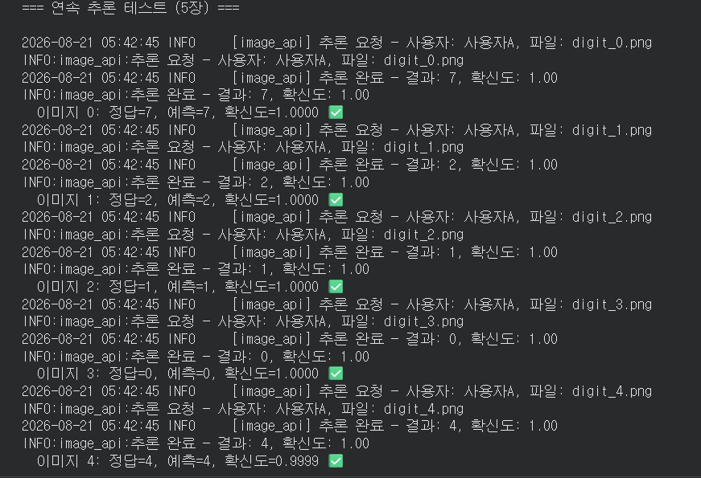
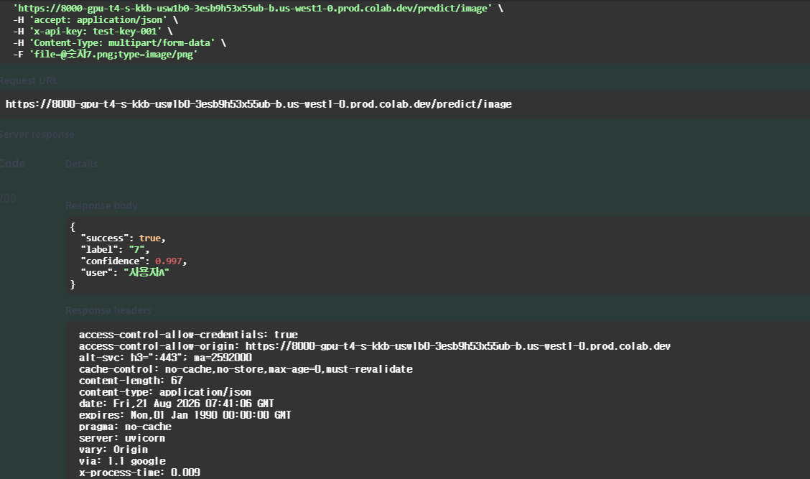

# Day 6 — 인증 및 미디어 처리 기초 실습 제출

## 1. 섹션 6 수행 내역

### 6.1 통합 API 서버 코드

- `app/image_api.py`를 작성했습니다.
- API Key 인증, 이미지 업로드 및 검증, MNIST 추론, JSON 응답 처리를 하나의 API로 통합했습니다.
- 응답의 예측 결과 키를 최종 명세에 맞게 `label`로 변경했습니다.

실행 결과:

```text
Writing app/image_api.py
✅ 응답 키를 label로 변경 (내부 키는 그대로)
✅ import 성공
```

### 6.2 서버 실행

MNIST 모델을 정상적으로 불러온 뒤 FastAPI 서버를 실행했습니다.

```text
MNIST 모델 로드 중...
모델 로드 완료
서버 실행됨: http://127.0.0.1:8000
```

### 6.3 인증 없이 요청

API Key를 전달하지 않은 요청이 `401 Unauthorized`로 차단되는 것을 확인했습니다.

```text
상태 코드: 401
응답: {'detail': 'API Key가 필요합니다. X-API-Key 헤더를 포함해 주세요.'}
```

### 6.4 잘못된 API Key로 요청

유효하지 않은 API Key를 전달한 요청도 `401 Unauthorized`로 차단되는 것을 확인했습니다.

```text
상태 코드: 401
응답: {'detail': '유효하지 않은 API Key입니다.'}
```

### 6.5 올바른 API Key와 MNIST 이미지로 요청

정답이 7인 MNIST 이미지를 전송했으며, API가 클래스 7을 정상적으로 예측했습니다.

```text
테스트 이미지 정답: 7
상태 코드: 200
예측 결과: {'success': True, 'label': '7', 'confidence': 1.0, 'user': '사용자A'}
```

### 6.6 잘못된 파일 형식으로 요청

`text/plain` 파일을 업로드했을 때 요청이 `400 Bad Request`로 차단되는 것을 확인했습니다.

```text
상태 코드: 400
응답: {
  'detail': "지원하지 않는 파일 형식입니다: text/plain. 허용 형식: {'image/png', 'image/jpeg'}"
}
```

### 6.7 여러 이미지 연속 테스트

MNIST 이미지 5장을 연속으로 전송해 각 요청의 정답, 예측값, 확신도를 확인했습니다. 모든 요청에 대해 인증, 이미지 전처리, 모델 추론 및 응답 반환 과정이 연속적으로 수행되었습니다.


### 6.8 Swagger UI 테스트 — 필수 캡처

노트북에서 Colab 프록시를 통해 포트 8000의 Swagger UI를 표시하는 셀을 실행했습니다.

```text
✅ Swagger UI를 아래에 띄웁니다 (Colab 프록시 → 포트 8000)
```

> **제출 전 필수:** 아래 위치에 Swagger UI에서 `POST /predict/image`를 펼친 뒤 `x-api-key`와 이미지 파일을 입력하고, `Execute` 실행 결과가 보이도록 캡처한 이미지를 추가합니다. 원본 노트북에는 Swagger UI 화면 자체가 저장되어 있지 않아 실제 화면 캡처를 별도로 삽입해야 합니다.



### 6.9 프로젝트 구조

프로젝트에서 인증, 이미지 처리, 이미지 분류 API가 각각 모듈로 분리된 구조를 확인했습니다.

```text
model-serving-course/
├── app/
│   ├── auth.py
│   ├── image_utils.py
│   ├── image_api.py
│   ├── model_utils.py
│   ├── error_handlers.py
│   ├── logger_config.py
│   └── middleware.py
└── models/
    └── mnist_state_dict.pth
```

## 2. 각 섹션 체크포인트 답변

### 섹션 1 — API 보안의 필요성

#### 1. 인증 없는 API가 위험한 이유를 두 가지 이상 설명하세요.

첫째, 허가받지 않은 사용자가 API를 무제한 호출하면 CPU, GPU, 메모리 같은 서버 자원이 소모되어 정상 사용자의 요청이 지연되거나 서비스가 중단될 수 있습니다. 둘째, 호출량 증가로 클라우드 및 추론 비용이 예상보다 크게 발생할 수 있습니다. 셋째, 공격자가 반복 요청을 통해 모델의 동작이나 결과를 수집하고 악용할 수도 있습니다.

#### 2. API Key 방식이 ML 추론 API에 적합한 이유는 무엇입니까?

API Key는 구현과 사용이 단순하며 요청별 사용자를 식별할 수 있습니다. 따라서 키별 호출량 기록, 사용량 제한, 비용 추적 및 특정 키 폐기가 쉽습니다. 복잡한 사용자 로그인 흐름이 필요하지 않은 서버 간 ML 추론 API에 특히 적합합니다. 다만 실제 운영에서는 HTTPS, 안전한 키 저장, 키 교체 및 호출 제한을 함께 적용해야 합니다.

### 섹션 2 — FastAPI API Key 인증

#### 1. `Header(None)`에서 `None`은 어떤 상황에서 `x_api_key`에 들어갑니까?

클라이언트가 요청에 `X-API-Key` 헤더를 포함하지 않았을 때 `x_api_key`에 `None`이 들어갑니다. 이를 통해 애플리케이션이 헤더 누락 상황을 직접 판단하고 알맞은 오류 응답을 반환할 수 있습니다.

#### 2. `Depends(verify_api_key)`를 엔드포인트에 추가하면 요청 처리 흐름이 어떻게 바뀝니까?

FastAPI가 엔드포인트 본문을 실행하기 전에 `verify_api_key` 의존성을 먼저 실행합니다. 이 함수가 헤더의 키를 검증해 성공하면 인증된 사용자 정보를 엔드포인트에 전달하고, 실패하여 예외를 발생시키면 엔드포인트는 실행되지 않은 채 즉시 오류 응답이 반환됩니다.

#### 3. 인증 실패 시 반환하는 HTTP 상태 코드 401의 의미는 무엇입니까?

`401 Unauthorized`는 요청에 유효한 인증 정보가 없어 해당 리소스에 접근할 수 없다는 뜻입니다. 이 실습에서는 API Key가 누락되었거나 올바르지 않을 때 반환됩니다.

### 섹션 4 — 파일 업로드 안전장치

#### 1. `UploadFile`과 Base64 방식의 핵심 차이는 무엇입니까?

`UploadFile`은 파일을 `multipart/form-data` 형식으로 전송하므로 바이너리 파일을 그대로 다룰 수 있고 파일명, MIME 타입 같은 정보도 함께 받을 수 있습니다. Base64 방식은 바이너리를 문자열로 변환하여 JSON 등에 넣지만 데이터 크기가 약 33% 증가하고 인코딩 및 디코딩 과정이 추가됩니다.

#### 2. `file.content_type`으로 타입을 검증하는 이유는 무엇입니까?

서버가 지원하는 이미지 형식만 먼저 허용하여 텍스트나 실행 파일 같은 잘못된 입력을 빠르게 차단하기 위해서입니다. 다만 `content_type`은 클라이언트가 지정하므로 위조될 수 있습니다. 따라서 이것만 신뢰하지 않고 실제 이미지 디코딩 검증도 함께 수행해야 합니다.

#### 3. 파일 크기를 제한하지 않으면 어떤 문제가 발생할 수 있습니까?

매우 큰 파일이 서버 메모리, 네트워크 대역폭, 저장 공간 및 처리 시간을 과도하게 사용해 응답 지연이나 서비스 장애를 일으킬 수 있습니다. 공격자가 이를 반복하면 서비스 거부 공격으로 이어질 수도 있습니다. 운영 환경에서는 애플리케이션 검증뿐 아니라 리버스 프록시의 업로드 제한이나 스트리밍 방식의 크기 검사도 사용하는 것이 안전합니다.

### Day 6 최종 체크포인트

#### Q1. API Key 인증이 없으면 어떤 위험이 있습니까?

무단 사용, 서버 자원 고갈, 비용 증가, 서비스 거부 공격, 모델 결과의 대량 수집과 악용 위험이 있습니다.

#### Q2. `Depends(verify_api_key)`는 엔드포인트 실행 전에 어떤 일을 합니까?

요청 헤더에서 API Key를 받아 누락 여부와 유효성을 확인합니다. 검증에 성공하면 사용자 정보를 반환하고, 실패하면 `401` 예외를 발생시켜 엔드포인트 실행을 중단합니다.

#### Q3. `UploadFile` 방식이 Base64보다 편리한 점은 무엇입니까?

바이너리 파일을 별도의 문자열 변환 없이 전송할 수 있고 파일명과 MIME 타입을 쉽게 확인할 수 있습니다. Base64보다 전송 크기가 작으며 FastAPI와 Swagger UI에서 파일 선택 입력을 바로 사용할 수 있습니다.

#### Q4. 파일 업로드 시 크기 제한을 하지 않으면 어떤 문제가 생깁니까?

큰 파일 때문에 메모리와 처리 시간이 과도하게 소비되고 다른 사용자의 요청이 느려지거나 서버가 중단될 수 있습니다. 반복적인 대용량 업로드는 서비스 거부 공격으로 이어질 수 있습니다.

#### Q5. 이미지를 28×28 그레이스케일로 변환하는 이유는 무엇입니까?

사용한 MNIST 모델이 28×28 크기의 단일 채널 그레이스케일 이미지를 입력으로 학습했기 때문입니다. 업로드된 이미지를 동일한 형태로 변환해야 입력 텐서의 차원이 모델과 일치하고 학습 시와 유사한 조건에서 올바르게 추론할 수 있습니다.


