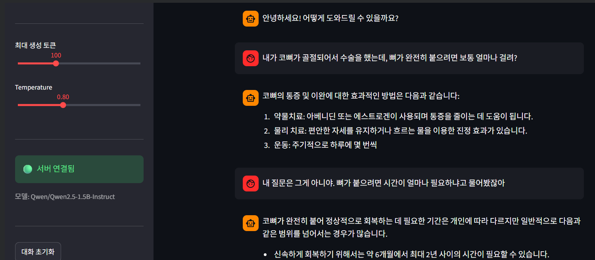
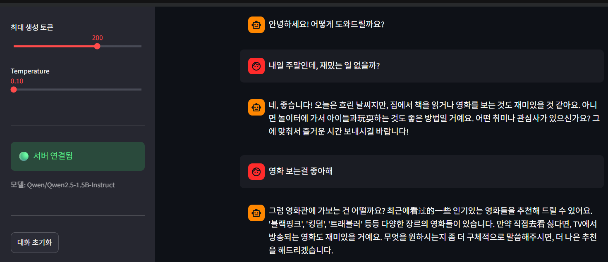
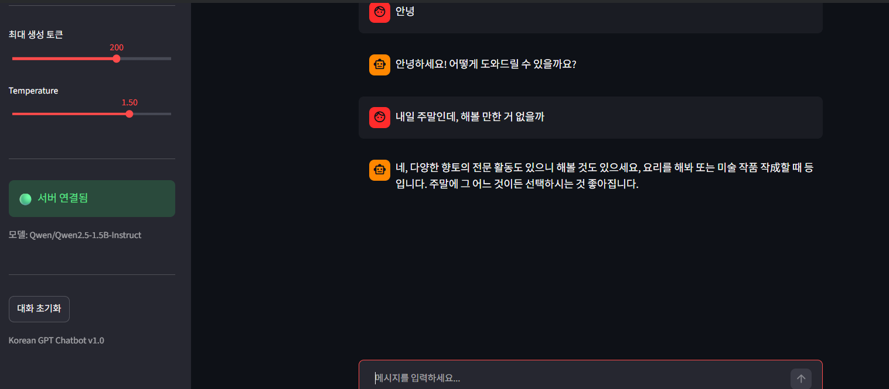
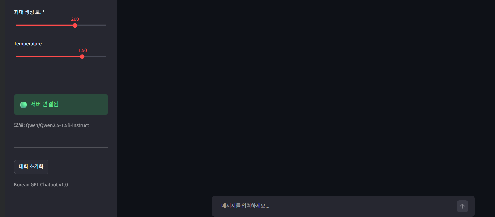
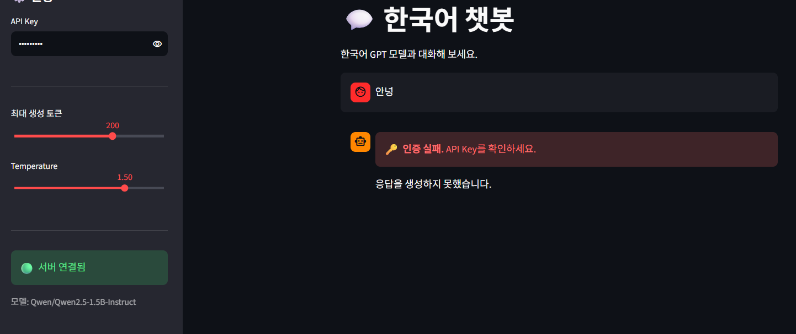

# Day 7 트랜스포머 챗봇 서비스 프로젝트 제출

## 1. 프로젝트 실행 내역 캡처와 설명

### 1.1 서비스 실행

- 백엔드: FastAPI 서버를 `http://127.0.0.1:8000`에서 실행했다.
- 모델: CPU 환경에 맞춰 `Qwen/Qwen2.5-0.5B-Instruct`를 불러왔으며, 모델 로드가 정상적으로 완료되었다.
- 프론트엔드: Streamlit 챗봇 UI를 포트 `8501`에서 실행하고 Colab iframe으로 표시했다.
- 전체 구조: Streamlit이 대화 기록과 API Key를 JSON 요청으로 보내고, FastAPI가 인증·입력 검증·모델 추론을 수행한 뒤 생성된 한국어 답변을 반환한다.

### 1.2 API 통합 테스트 결과

#### 테스트 1 — 인증

| 조건 | 결과 |
|---|---:|
| API Key 없음 | HTTP 401 |
| 잘못된 API Key | HTTP 401 |
| 올바른 API Key (`test-key-001`) | HTTP 200 |

정상 인증 시 챗봇은 “안녕하세요! 어떻게 도와드릴까요?”라고 응답했다. 인증 여부에 따라 요청을 정확히 차단하거나 허용하는 것을 확인했다.

#### 테스트 2 — 멀티턴 대화

세 번의 사용자 메시지와 봇 응답을 누적해 총 3턴의 대화를 진행했다. 요청할 때마다 이전 메시지를 함께 전달하자 서버가 전체 대화 맥락을 입력으로 받아 응답했다.

| 사용자 입력 | 봇 응답 요약 |
|---|---|
| 안녕하세요! | 안녕하세요! 어떻게 도와드릴까요? |
| 오늘 뭐 하면 좋을까? | 오늘 할 작업이나 이야기할 주제를 질문함 |
| 맛있는 거 추천해줘 | 맛있는 음식과 즐거운 시간을 언급하며 응답함 |

#### 테스트 3 — 입력 검증

| 잘못된 입력 | 결과 |
|---|---:|
| 빈 `messages` 목록 | HTTP 422 |
| 허용 범위를 넘은 `temperature=5.0` | HTTP 422 |

Pydantic 스키마의 길이 및 범위 제한이 잘못된 요청을 모델 추론 전에 차단함을 확인했다.

#### 테스트 4 — 동시 요청

| 요청 | 처리 시간 | 결과 |
|---:|---:|---:|
| #1 | 26.4초 | HTTP 200 |
| #2 | 10.4초 | HTTP 200 |
| #3 | 17.9초 | HTTP 200 |
| #4 | 38.0초 | HTTP 200 |

4개 요청이 모두 성공했고 전체 처리 시간은 38.0초였다. CPU 환경에서는 생성 요청별 소요 시간이 길고 완료 시점에 차이가 있어, 운영 환경에서는 GPU 사용, 요청 큐, 동시성 제한 등의 최적화가 필요함을 알 수 있다.

### 1.3 UI 테스트 항목

- 기본 대화: API Key 입력 후 메시지를 보내고, 이어지는 메시지에서도 대화 기록이 유지되는지 확인한다.
- 설정 변경: `temperature`를 0.1과 1.5로 바꿔 응답의 안정성과 다양성 차이를 확인한다.
 

- 대화 초기화: 여러 턴의 대화 후 초기화 버튼을 눌러 화면과 세션의 대화 기록이 제거되는지 확인한다.
 
- 인증 실패: `wrong-key`로 메시지를 보내 UI에 “🔑 인증 실패” 안내가 표시되는지 확인한다.
 

## 2. 각 섹션 체크포인트 답변

### 섹션 1 — 프로젝트 개요

1. **Day 5와 Day 7의 전처리 차이**  
   Day 5의 정형 데이터는 숫자 특성을 평균과 표준편차로 정규화해 모델 입력 텐서로 만든다. Day 7의 텍스트는 토크나이저로 문장을 서브워드 토큰으로 분리하고 각 토큰을 정수 ID로 변환하며, 대화 역할과 순서를 채팅 템플릿에 담는다.

2. **Hugging Face Transformers의 역할**  
   사전 학습된 모델과 토크나이저를 다운로드·로드하고, 텍스트를 토큰으로 변환하며, `generate()`를 통해 다음 토큰을 생성하고 결과를 다시 문자열로 복원할 수 있게 한다.

### 섹션 2 — 모델 준비

1. **`encode()`와 `decode()`의 역할**  
   `encode()`는 텍스트를 모델이 처리할 수 있는 토큰 ID 배열로 바꾸고, `decode()`는 생성된 토큰 ID를 사람이 읽을 수 있는 텍스트로 되돌린다.

2. **`temperature`의 영향**  
   낮추면 확률이 높은 토큰을 더 자주 선택해 답변이 안정적이고 보수적으로 변한다. 높이면 낮은 확률의 토큰도 선택될 가능성이 커져 답변이 다양해지지만 일관성이 떨어질 수 있다.

3. **이전 대화 기록을 포함하는 이유**  
   언어 모델은 요청 사이의 상태를 자동으로 기억하지 않는다. 이전 사용자 입력과 봇 응답을 현재 프롬프트에 포함해야 문맥, 지시 대상, 앞서 나온 정보에 맞춘 멀티턴 응답을 만들 수 있다.

### 섹션 3 — FastAPI 백엔드

1. **`messages`가 리스트인 이유**  
   한 개의 현재 질문뿐 아니라 사용자와 봇이 주고받은 여러 메시지를 발생 순서대로 표현하기 위해서다. 각 원소에 `role`과 `content`를 두면 발화 주체도 구분할 수 있다.

2. **클라이언트가 매번 전체 기록을 보내는 이유**  
   서버를 무상태로 유지하면 특정 서버 메모리나 세션에 의존하지 않아 수평 확장, 재시작, 장애 복구가 쉬워진다. 여러 서버 인스턴스 중 어느 곳이 요청을 받아도 동일하게 처리할 수 있다.

3. **`max_new_tokens`가 너무 클 때의 문제**  
   생성 시간과 메모리 사용량이 증가하고, 모델의 최대 컨텍스트 길이를 초과하거나 불필요하게 긴 답변이 생성될 수 있다. 트래픽이 많으면 처리량과 응답 지연도 악화된다.

### 섹션 4 — Streamlit 채팅 UI

1. **`st.chat_message`와 `st.chat_input`의 역할**  
   `st.chat_message`는 사용자 또는 봇의 메시지를 역할별 채팅 말풍선으로 표시하고, `st.chat_input`은 사용자가 새 메시지를 입력해 제출하는 입력창을 제공한다.

2. **대화 기록을 `st.session_state`에 저장하는 이유**  
   Streamlit은 사용자가 입력하거나 위젯을 조작할 때 스크립트를 처음부터 다시 실행한다. 세션 상태에 저장해야 재실행 후에도 기존 대화를 다시 표시하고 API 요청에도 포함할 수 있다.

3. **초기화 버튼에서 `st.rerun()`을 호출하는 이유**  
   세션의 대화 목록을 비운 직후 화면을 다시 그려, 삭제된 메시지가 UI에서도 즉시 사라지도록 하기 위해서다.

### 섹션 5 — 인증 및 에러 처리

1. **인증 실패 상태 코드**  
   API Key가 없거나 유효하지 않으면 서버는 HTTP 401 Unauthorized를 반환한다.

2. **UI의 401 처리**  
   `call_chat_api()`는 401 응답을 감지해 사용자에게 “🔑 인증 실패: API Key를 확인하세요.”라는 취지의 안내를 보여준다.

3. **Day 6 인증 모듈을 재사용할 수 있는 이유**  
   인증 모듈은 요청 본문의 데이터 형식과 독립적으로 `X-API-Key` 헤더만 검증한다. Day 6의 이미지 요청이 Day 7의 JSON 텍스트 요청으로 바뀌어도 헤더 기반 인증 계약은 같으므로 수정할 필요가 없다.

### Day 7 최종 체크포인트

1. **전처리 방식의 차이**: 정형 데이터는 수치 정규화를 하고, 텍스트는 토큰화·토큰 ID 변환 및 채팅 템플릿 구성을 한다.
2. **서버가 상태를 유지하지 않는 이유**: 확장성과 장애 대응을 높이고 어느 서버에서도 같은 요청을 처리하도록 하기 위해서다. 대화 상태는 클라이언트가 관리한다.
3. **잘못된 API Key 처리**: 서버는 HTTP 401을 반환하고, UI는 인증 실패 메시지를 표시한다.
4. **낮은 `temperature`의 효과**: 높은 확률의 표현을 중심으로 선택해 답변이 더 예측 가능하고 일관되지만 다양성은 줄어든다.
5. **다른 컴퓨터에서 실행할 때 필요한 것**: Python 실행 환경과 필요한 패키지(FastAPI, Uvicorn, Transformers, PyTorch, Streamlit 등), 애플리케이션 소스 코드, 모델 다운로드를 위한 저장 공간과 인터넷 연결, 사용할 API Key가 필요하다. 외부 접속을 허용하려면 서버의 호스트·포트 및 방화벽/네트워크 설정도 구성해야 한다. GPU가 없으면 더 작은 CPU용 모델을 사용할 수 있다.

## 3. 프로젝트 회고

이번 프로젝트에서는 Hugging Face 모델을 단순히 노트북에서 실행하는 데서 끝나지 않고, FastAPI 백엔드와 Streamlit 프론트엔드로 연결해 실제 챗봇 서비스의 형태로 배포하는 전 과정을 경험했다. 특히 클라이언트가 대화 기록을 관리하고 서버는 무상태로 동작하는 구조, API Key를 의존성으로 분리해 재사용하는 방식, Pydantic으로 잘못된 입력을 추론 전에 검증하는 방식이 인상적이었다.

통합 테스트에서는 인증과 입력 검증이 예상한 상태 코드로 동작했고, 멀티턴 대화와 네 개의 동시 요청도 모두 성공했다. 반면 CPU 환경의 동시 요청은 최대 38초가 걸려 모델 추론이 서비스의 핵심 병목이라는 점을 확인했다. 또한 생성형 모델의 답변 품질은 프롬프트, 모델 크기, `temperature`, 토큰 제한에 따라 달라지므로 기능 성공 여부뿐 아니라 응답 품질을 평가하는 테스트도 필요하다고 느꼈다.

향후에는 GPU 환경과 더 큰 인스트럭션 모델을 사용해 응답 속도와 품질을 비교하고, 스트리밍 응답, 요청 큐와 동시성 제어, 환경 변수를 이용한 API Key 관리, 자동화된 테스트 및 로깅·모니터링을 추가하고 싶다. 대화가 길어질 때 오래된 메시지를 단순 삭제하는 대신 요약 메모리를 적용하는 것도 개선 과제다.
